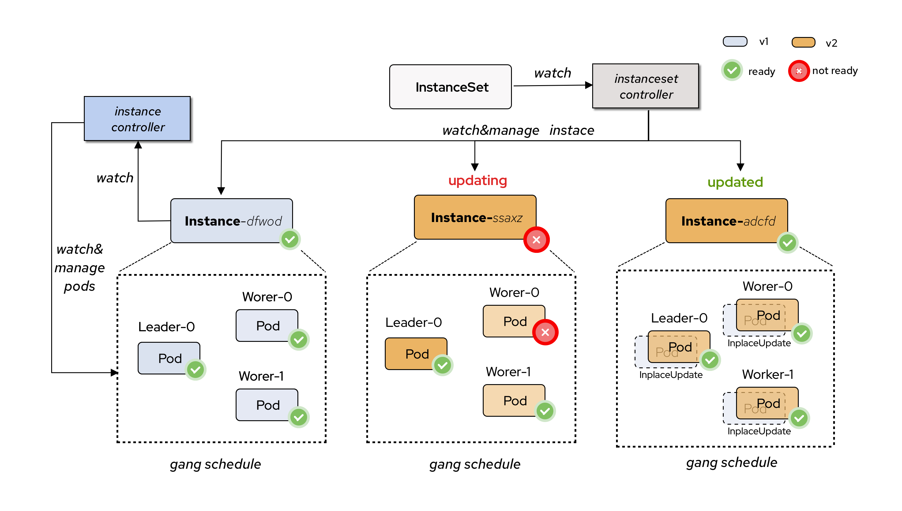

# Instance

An Instance is a collection of Pods. The lifecycle of Pods managed by the Instance is tightly bound, as shown in the figure below.
The Instance controls the upgrades and status updates for this group of Pods.

More importantly, the Instance supports the in-place update of its Pods.



## Instance Ready Status

The Instance's ReadyPolicy supports two types: `AllPodReady` and `None`. When set to `AllPodReady`,
the Instance will be `Ready` only when all its owned Pods are in the `Ready` condition.

```go
type InstanceReadyPolicyType string

const (
 // InstanceReadyOnAllPodReady means all Pods in the Instance must be ready when Instance Ready
 InstanceReadyOnAllPodReady InstanceReadyPolicyType = "AllPodReady"

 // InstanceReadyPolicyTypeNone means do nothing for Pods
 InstanceReadyPolicyTypeNone InstanceReadyPolicyType = "None"
)
```

```shell
kubectl apply -f - <<EOF
apiVersion: workloads.x-k8s.io/v1alpha1
kind: Instance
metadata:
  name: nginx
  namespace: default
spec:
  readyPolicy: AllPodReady
  components:
    - name: leader
      size: 1
      template:
        spec:
          containers:
            - name: nginx
              image: nginx:1.28.0
              ports:
                - containerPort: 8080
    - name: worker
      size: 2
      template:
        spec:
          containers:
            - name: nginx
              image: nginx:1.28.0
              ports:
                - containerPort: 8080
EOF
```

```shell
$ kubectl get pod
NAME             READY   STATUS    RESTARTS   AGE
nginx-leader-0   1/1     Running   0          6s
nginx-worker-0   1/1     Running   0          6s
nginx-worker-1   1/1     Running   0          6s
$ kubectl get instances nginx
NAME    READY   AGE
nginx   True    10s
```

## Inplace-Update

The Instance supports in-place updates of Pods when the metadata or image in the component's template is modified. Next, We try to
update nginx-leader's image to `nginx:1.29.2`

```shell
kubectl apply -f - <<EOF
apiVersion: workloads.x-k8s.io/v1alpha1
kind: Instance
metadata:
  name: nginx
  namespace: default
spec:
  readyPolicy: AllPodReady
  components:
    - name: leader
      size: 1
      template:
        spec:
          containers:
            - name: nginx
              image: nginx:1.29.2
              ports:
                - containerPort: 8080
    - name: worker
      size: 2
      template:
        spec:
          containers:
            - name: nginx
              image: nginx:1.28.0
              ports:
                - containerPort: 8080
EOF
```

```shell
$ kubectl get pod
NAME             READY   STATUS    RESTARTS     AGE
nginx-leader-0   1/1     Running   1 (5s ago)   8m54s
nginx-worker-0   1/1     Running   0            8m54s
nginx-worker-1   1/1     Running   0            8m54s
$ kubectl get instances nginx
NAME    READY   AGE
nginx   True    8m57s
```

Pod `nginx-leader-0` was updated in-place with its restart count set to `1`.

## Headless Service

Instance support set `serviceName` for component, pods can use headless service request each other.

```shell
kubectl apply -f - <<EOF
apiVersion: workloads.x-k8s.io/v1alpha1
kind: Instance
metadata:
  name: nginx
  namespace: default
spec:
  readyPolicy: AllPodReady
  components:
    - name: leader
      size: 1
      serviceName: nginx
      template:
        metadata:
          labels:
            app: nginx
        spec:
          containers:
            - name: nginx
              image: nginx:1.29.2
              ports:
                - containerPort: 8080
    - name: worker
      size: 2
      serviceName: nginx
      template:
        metadata:
          labels:
            app: nginx
        spec:
          containers:
            - name: nginx
              image: nginx:1.28.0
              ports:
                - containerPort: 8080
---
apiVersion: v1
kind: Service
metadata:
  name: nginx
spec:
  clusterIP: None 
  ports:
    - port: 8080
      protocol: TCP
      targetPort: 8000
  selector:
      app: nginx
EOF
```

```shell
$ kubectl get pod
NAME             READY   STATUS    RESTARTS   AGE
nginx-leader-0   1/1     Running   0          4m59s
nginx-worker-0   1/1     Running   0          4m59s
nginx-worker-1   1/1     Running   0          4m59s
$ kubectl  get pod -owide
NAME             READY   STATUS    RESTARTS   AGE     IP            NODE                 NOMINATED NODE   READINESS GATES
nginx-leader-0   1/1     Running   0          7m34s   10.244.0.31   kind-control-plane   <none>           2/2
nginx-worker-0   1/1     Running   0          7m34s   10.244.0.33   kind-control-plane   <none>           2/2
nginx-worker-1   1/1     Running   0          7m34s   10.244.0.32   kind-control-plane   <none>           2/2
$ kubectl exec -it nginx-leader-0 -- /bin/bash
root@nginx-leader-0:/# nslookup nginx-worker-0.nginx.default.svc.cluster.local
;; Got recursion not available from 10.96.0.10
Server:         10.96.0.10
Address:        10.96.0.10#53

Name:   nginx-worker-0.nginx.default.svc.cluster.local
Address: 10.244.0.33
;; Got recursion not available from 10.96.0.10

root@nginx-leader-0:/#
```
