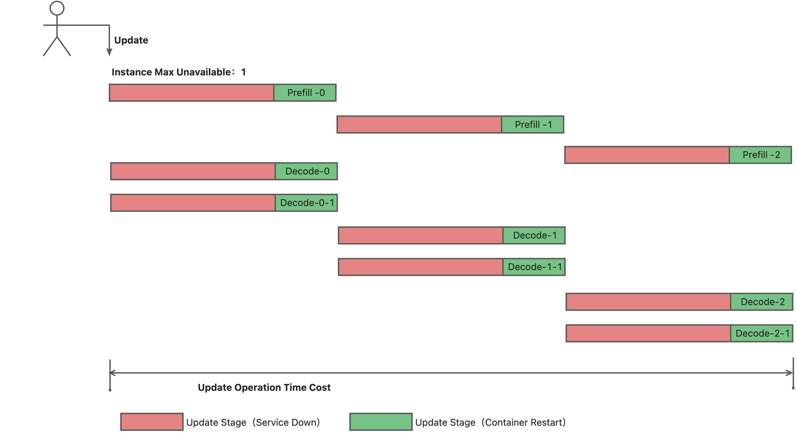
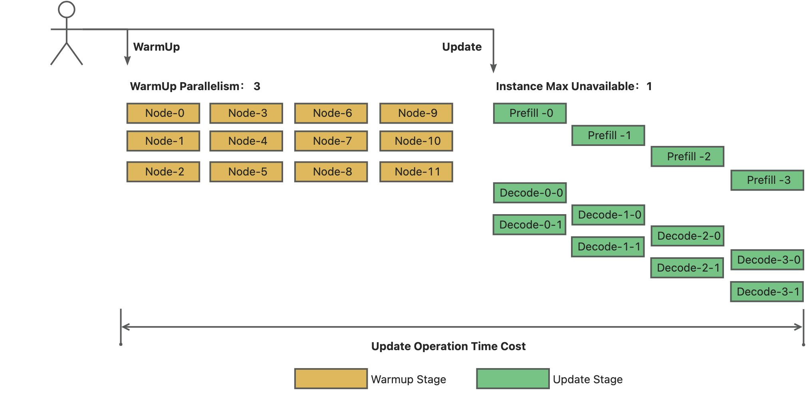
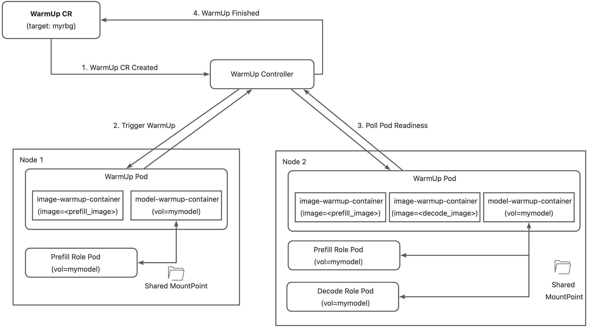
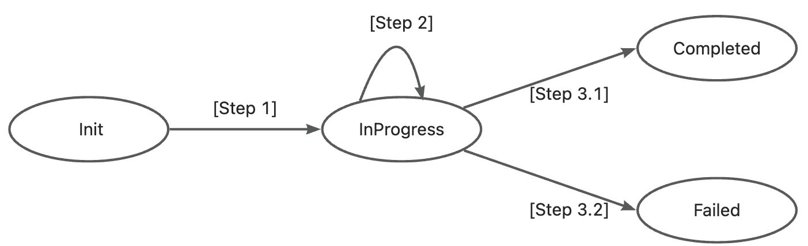
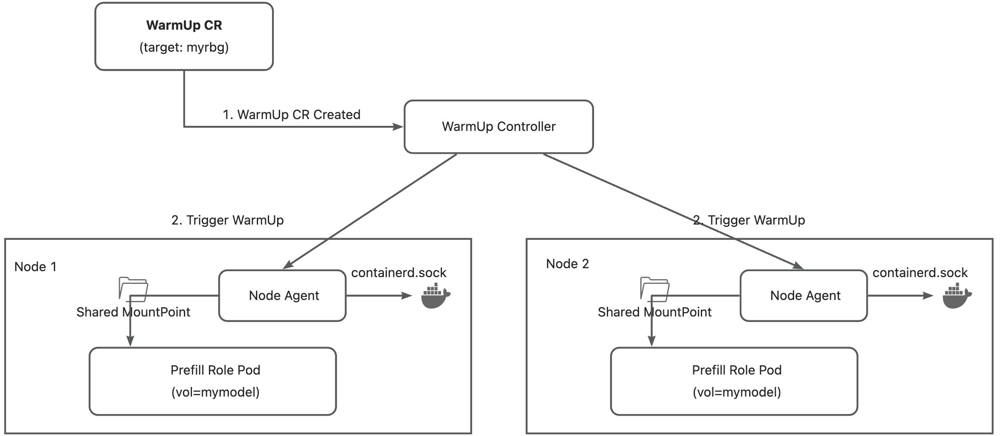
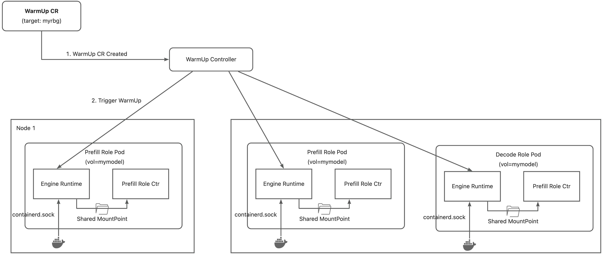

# KEP-129: Image and Volume Warmup for RoleBasedGroup

<!-- toc -->

- [Summary](#summary)
- [Motivation](#motivation)
    - [Goals](#goals)
    - [Non-Goals](#non-goals)
- [Proposal](#proposal)
    - [Architecture](#architecture)
    - [User Stories](#user-stories)
        - [Story 1](#story-1)
        - [Story 2](#story-2)
    - [API Changes](#api-changes)
        - [Spec](#spec)
        - [Status](#status)
    - [YAML Example](#yaml-example)
    - [Risks and Mitigations](#risks-and-mitigations)
- [Design Details](#design-details)
    - [Controller Logic](#controller-logic)
        - [WarmUp Job State Machine](#warmup-job-state-machine)
        - [Pod Construction](#pod-construction)
        - [Multi-Role Merge Algorithm](#multi-role-merge-algorithm)
        - [Pod Naming and State Recovery](#pod-naming-and-state-recovery)
    - [Resource Consumption](#resource-consumption)
    - [Cleanup and Garbage Collection](#cleanup-and-garbage-collection)
    - [Failure Handling](#failure-handling)
        - [Early Termination Behavior](#early-termination-behavior)
    - [RBAC Requirements](#rbac-requirements)
    - [Coordination with RBG Upgrades](#coordination-with-rbg-upgrades)
    - [Test Plan](#test-plan)
        - [Unit Tests](#unit-tests)
        - [Integration Tests (envtest)](#integration-tests-envtest)
        - [E2E Tests (Kind cluster)](#e2e-tests-kind-cluster)
- [Alternative Designs](#alternative-designs)
    - [Architecture Alternatives](#architecture-alternatives)

<!-- /toc -->

## Summary

This KEP proposes adding image and volume warmup capabilities to RoleBasedGroup (RBG). Cold start is a common problem for serving large language models (LLMs).
Cold start latency can be reduced by pre-warming the model files and the container image before a serving instance starts. In RBG's design, upgrades can be done in a fine-grained manner (e.g. [Role Coordination](../30-role-coordination/README.md)). Image and volume warmup can be an additional step to speed up the upgrade process, avoiding resource utilization degradation.

## Motivation

In a production environment, availability and GPU resource utilization are key metrics for large language model inference services. In-place update reduces time consumption by avoiding recreating Pods, but the cold start latency of the inference service (e.g. SGLang Worker) can still be high and thus affecting service availability. There are two key factors that affect the cold start latency:
- The size of the container image (e.g. SGLang v0.5.5 image size is about 27.5GB after decompression)
- The size of large language model files (e.g. Total size of Qwen3-32B is about 61GB)

Image and volume warmup can help reduce the cold start latency. By introducing an extra "warmup stage" before the upgrade process, the process becomes more efficient. It takes less time for RoleBasedGroup to rolling update each inference engine instance, so both the service availability and GPU utilization will be improved.

Without WarmUp:


With WarmUp:


### Goals

- Support WarmUp job that can be submitted by a user. For each target node, the job warms up images and volumes according to the job's configuration.

### Non-Goals

- Although it's possible to upgrade RBG and warm up images & volumes in a coordinated way, co-design between WarmUp and RBG's upgrade process is not a goal in this enhancement.
- `dataCopy` action (copying model files between volumes) is deferred to the future. The current scope focuses on image preload and customized warmup actions.

## Proposal

### Architecture



The WarmUp Controller collects node information based on the target configuration (explicit node list, node selector, or from an existing RoleBasedGroup). It deploys one WarmUp Pod to each target node. Each WarmUp Pod contains:
- N containers for image preload action, configured with `image=<new_image>` and a startup command set to `exit 0`. These containers pull the image and exit immediately.
- M containers for customized action, which allow users to define a customized warmup process.
  - Use cases for customized warmup: (1) Model download & copy from external storage; (2) CUDA kernel build before launching a new model inference instance.

When all containers in the Pod finish successfully, the node is considered warmed up. If all nodes have completed the process, the WarmUp job succeeds.

### User Stories

#### Story 1

As a platform operator, I want to pre-pull new container images onto all GPU nodes before triggering a rolling update of my SGLang inference cluster, so that the upgrade is faster and incurs less GPU idle time.

#### Story 2

As an ML engineer, I want to run a custom CUDA kernel compilation warmup on each node before upgrading, so that the new model version can start serving immediately after the container image is swapped.

### API Changes

A new CRD `RoleBasedGroupWarmup` is introduced under the `workloads.x-k8s.io` API group (v1alpha2). Although this is a brand-new resource, it starts at v1alpha2 rather than v1alpha1 to align with the current storage version of the core `RoleBasedGroup` CRD. All workloads in this API group have already graduated to v1alpha2, and introducing a new resource at v1alpha1 would require unnecessary conversion webhooks from day one.

#### Spec

| Field                  | Type                    | Description                                                                                             |
|------------------------|-------------------------|---------------------------------------------------------------------------------------------------------|
| `paused`               | `*bool`                 | Suspends the warmup job. When true, no new warmup Pods are created, but existing Pods continue running. |
| `policies`             | `*WarmupPolicies`       | Controls parallelism, TTL, and other execution behavior.                                                |
| `targetNodes`          | `*TargetNodes`          | Specifies explicit nodes and warmup actions. Mutually exclusive with `targetRoleBasedGroup`.            |
| `targetRoleBasedGroup` | `*TargetRoleBasedGroup` | Discovers target nodes from an existing RBG. Mutually exclusive with `targetNodes`.                     |
| `tolerations`          | `[]Toleration`          | Tolerations for warmup Pods (e.g., to schedule on GPU-tainted nodes).                                   |

**WarmupPolicies:**

| Field                     | Type     | Description                                                                                                                                                                                                                     |
|---------------------------|----------|---------------------------------------------------------------------------------------------------------------------------------------------------------------------------------------------------------------------------------|
| `parallelism`             | `*int32` | Max number of nodes warmed up concurrently. If unset, all nodes run in parallel.                                                                                                                                                |
| `backoffLimitPerNode`     | `*int32` | Max retries per node before marking it permanently failed. If unset (nil), nodes are retried indefinitely. If set to 0, no retries — first failure is final.                                                                    |
| `maxFailedNodes`          | `*int32` | Max permanently-failed nodes tolerated before failing the entire job. If unset (nil), any number of failures is tolerated. If set to 0, any failure fails the job. Requires `backoffLimitPerNode` to be set (enforced via CEL). |
| `globalTimeoutSeconds`    | `*int64` | Overall timeout measured from `status.startTime`. When exceeded, active Pods are deleted and the job is marked Failed. If unset (nil), no timeout is applied.                                                                   |
| `ttlSecondsAfterFinished` | `*int32` | Time-to-live after the job reaches a terminal phase. When expired, the resource and its owned Pods are auto-deleted. If unset, the resource is not auto-deleted.                                                                |

**`maxFailedNodes` requires `backoffLimitPerNode`:** When `backoffLimitPerNode` is unset, nodes are retried indefinitely — a node never reaches the "permanently failed" state. In that scenario, `maxFailedNodes` would have no observable effect since the set of permanently-failed nodes is always empty, making it impossible for the threshold to be exceeded. Rather than silently ignoring the field, the API server rejects this combination at admission time via a CEL validation rule: `!has(self.maxFailedNodes) || has(self.backoffLimitPerNode)`. This ensures users get immediate feedback when their policy configuration is logically inconsistent.

**TargetNodes:**

| Field          | Type                | Description                                                          |
|----------------|---------------------|----------------------------------------------------------------------|
| `nodeNames`    | `[]string`          | Explicit list of node names. Mutually exclusive with `nodeSelector`. |
| `nodeSelector` | `map[string]string` | Label selector for nodes. Mutually exclusive with `nodeNames`.       |
| (inline)       | `WarmupActions`     | Warmup actions to perform on each selected node.                     |

Mutual exclusivity between `nodeNames` and `nodeSelector` is enforced via CEL validation rules.

**TargetRoleBasedGroup:**

| Field   | Type                       | Description                                                               |
|---------|----------------------------|---------------------------------------------------------------------------|
| `name`  | `string`                   | Name of the RBG resource in the same namespace.                           |
| `roles` | `map[string]WarmupActions` | Maps role names to their warmup actions. Only listed roles are warmed up. |

**WarmupActions:**

| Field              | Type                  | Description                                          |
|--------------------|-----------------------|------------------------------------------------------|
| `imagePreload`     | `*ImagePreloadAction` | Pull container images onto the node ahead of time.   |
| `customizedAction` | `*CustomizedAction`   | Run user-defined containers for custom warmup logic. |

At least one of `imagePreload` or `customizedAction` must be specified (enforced via CEL).

**ImagePreloadAction:**

| Field         | Type                     | Description                                                |
|---------------|--------------------------|------------------------------------------------------------|
| `images`      | `[]string` (min: 1)      | Container images to preload.                               |
| `pullSecrets` | `[]LocalObjectReference` | Secrets for pulling private images (applied at Pod level). |

**CustomizedAction:**

| Field        | Type                   | Description                                      |
|--------------|------------------------|--------------------------------------------------|
| `containers` | `[]Container` (min: 1) | Containers to run for custom warmup logic.       |
| `volumes`    | `[]Volume`             | Volumes to mount into the customized containers. |

#### Status

| Field            | Type                 | Description                                              |
|------------------|----------------------|----------------------------------------------------------|
| `startTime`      | `*metav1.Time`       | When the first warmup Pod was created.                   |
| `completionTime` | `*metav1.Time`       | When all warmup Pods reached a terminal state.           |
| `desired`        | `int32`              | Total number of nodes to warm up.                        |
| `active`         | `int32`              | Number of warmup Pods currently running.                 |
| `succeeded`      | `int32`              | Number of nodes whose warmup Pod completed successfully. |
| `failed`         | `int32`              | Number of nodes whose warmup Pod failed.                 |
| `phase`          | `WarmupJobPhase`     | Current phase of the warmup job.                         |
| `conditions`     | `[]metav1.Condition` | Standard Kubernetes conditions (see below).              |

**WarmupJobPhase values:** `Running`, `Paused`, `Completed`, `Failed`.

**Condition types:**

| Type             | Status | Reason                         | Description                                                                                                                                                             |
|------------------|--------|--------------------------------|-------------------------------------------------------------------------------------------------------------------------------------------------------------------------|
| `Complete`       | True   | `WarmupCompleted`              | All nodes reached a terminal state and failures are within tolerance.                                                                                                   |
| `Complete`       | True   | `NoNodesMatched`               | No nodes matched the target configuration; job completed immediately.                                                                                                   |
| `Failed`         | True   | `GlobalTimeoutExceeded`        | `globalTimeoutSeconds` exceeded; active Pods were deleted.                                                                                                              |
| `Failed`         | True   | `MaxFailedNodesExceeded`       | Permanently-failed nodes exceeded `maxFailedNodes`.                                                                                                                     |
| `VolumeConflict` | True   | `ConflictingVolumeDefinitions` | Two roles defined the same volume name with different specs; the first definition wins. Containers from the other role may reference a volume spec they did not expect. |

Conditions persist on the status and are not subject to garbage collection (unlike Events), making them reliable for programmatic monitoring and alerting. Each condition includes `observedGeneration` to detect stale observations.

### YAML Example

```yaml
apiVersion: workloads.x-k8s.io/v1alpha2
kind: RoleBasedGroupWarmup
metadata:
  name: warmup-demo
  namespace: default
spec:
  paused: false
  policies:
    parallelism: 10
    backoffLimitPerNode: 3
    maxFailedNodes: 2
    globalTimeoutSeconds: 3600
    ttlSecondsAfterFinished: 86400
  tolerations:
  - key: "nvidia.com/gpu"
    operator: "Exists"
    effect: "NoSchedule"
  targetNodes:
    nodeSelector:
      gpu-type: a100
    imagePreload:
      images:
      - "registry.example.com/sglang:v0.6.0"
      - "registry.example.com/model-loader:v2.0"
      pullSecrets:
      - name: registry-secret
    customizedAction:
      containers:
      - name: cuda-warmup
        image: "registry.example.com/cuda-compiler:12.0"
        command: ["sh", "-c", "compile-kernels.sh && exit 0"]
        volumeMounts:
        - name: kernel-cache
          mountPath: /cache
      volumes:
      - name: kernel-cache
        hostPath:
          path: /var/cache/cuda-kernels
---
apiVersion: workloads.x-k8s.io/v1alpha2
kind: RoleBasedGroupWarmup
metadata:
  name: warmup-rbg-upgrade
  namespace: default
spec:
  policies:
    parallelism: 5
    backoffLimitPerNode: 2
    globalTimeoutSeconds: 1800
    ttlSecondsAfterFinished: 3600
  tolerations:
  - key: "nvidia.com/gpu"
    operator: "Exists"
    effect: "NoSchedule"
  targetRoleBasedGroup:
    name: sglang-cluster
    roles:
      decode:
        imagePreload:
          images:
          - "registry.example.com/sglang:v0.6.0"
      prefill:
        imagePreload:
          images:
          - "registry.example.com/sglang:v0.6.0"
        customizedAction:
          containers:
          - name: model-download
            image: "registry.example.com/model-loader:v2.0"
            command: ["sh", "-c", "download-model.sh /models/qwen3-32b"]
            volumeMounts:
            - name: model-storage
              mountPath: /models
          volumes:
          - name: model-storage
            hostPath:
              path: /mnt/models
```

### Risks and Mitigations

| Risk                                                                         | Mitigation                                                                                                                                                                                     |
|------------------------------------------------------------------------------|------------------------------------------------------------------------------------------------------------------------------------------------------------------------------------------------|
| Warmup Pods consume node resources and may compete with production workloads | Use minimal resource requests for image-preload containers; document best practice of setting low resource requests.                                                                           |
| Warmup Pods may get stuck (e.g., image pull backoff)                         | `globalTimeoutSeconds` provides an overall timeout. Controller restart is safe — Pod objects persist and are re-counted.                                                                       |
| Controller crash during warmup                                               | No in-memory state is required. On restart, the controller re-lists owned Pods and resumes from the current state. Failed Pods are preserved as persistent counters for `backoffLimitPerNode`. |

## Design Details

### Controller Logic

#### WarmUp Job State Machine



- **Step 1:** The controller discovers target nodes from `spec.targetNodes` (by node names or label selector) or `spec.targetRoleBasedGroup` (by listing Pods of the referenced RBG and extracting their node assignments). Sets `status.phase` to `Running`.

- **Step 2:** The controller creates one warmup Pod per target node. Each Pod is pinned to its node via `nodeSelector: {"kubernetes.io/hostname": <nodeName>}`. Pods are labeled with the warmup CR name, UID, and target node name for tracking. The total number of concurrent warmup Pods is limited by `spec.policies.parallelism`. Pods are created in deterministic order (sorted by node name) to ensure consistent behavior across controller restarts.

- **Step 3:** The controller watches owned Pods and updates status counters (`active`, `succeeded`, `failed`) on each reconciliation. When all nodes reach a terminal state (succeeded or permanently failed) and no active Pods remain:
  - If `failed == 0`: phase → `Completed`
  - If `failed > 0` and `maxFailedNodes` is nil (tolerate any): phase → `Completed`
  - If `failed > 0` and `failed > maxFailedNodes`: phase → `Failed`
  - `status.completionTime` is set.

- **Pause/Resume:** Setting `spec.paused: true` transitions the phase to `Paused` and stops creating new Pods. Existing Pods continue running. Clearing the field resumes the job. Note that `globalTimeoutSeconds` is measured from `status.startTime` and does **not** pause when the job is paused — if a job is paused longer than the remaining timeout, it will fail immediately upon resumption. This is by design: the timeout protects against indefinitely hanging jobs regardless of operator intervention, and pausing is not intended for long-term suspension.

- **TTL Cleanup:** After the job reaches a terminal phase, if `spec.policies.ttlSecondsAfterFinished` is set, the controller schedules a deferred reconciliation via `RequeueAfter`. When the TTL expires, the controller deletes the `RoleBasedGroupWarmup` resource, and owner references cascade-delete all owned Pods. For long TTLs, requeue intervals are capped at 10 minutes to avoid workqueue scheduling drift.

#### Pod Construction

Each warmup Pod contains:

1. **Image preload containers:** One container per unique image, with `command: ["sh", "-c", "exit 0"]` and `imagePullPolicy: IfNotPresent`. These containers pull the image onto the node's container runtime cache and exit immediately.

2. **Customized action containers:** User-defined containers for custom warmup logic (model download, CUDA compilation, etc.), along with their associated volumes.

3. **Pod-level settings:**
   - `restartPolicy: Never` — failed Pods are preserved for failure counting and log inspection.
   - `tolerations` from `spec.tolerations` — allows scheduling on tainted nodes (e.g., GPU nodes with `nvidia.com/gpu` taint).
   - `imagePullSecrets` — deduplicated from all `imagePreload.pullSecrets`.

All warmup containers (both image preload and customized actions) run as regular containers, not init containers. This allows concurrent image pulling — with multiple large AI inference images (20-30GB each), serial pulling via init containers would significantly increase total warmup time. Actual concurrency is subject to the container runtime's configuration (e.g., containerd's `max_concurrent_downloads`, which defaults to 3), but concurrent pulls up to that limit are strictly better than the fully serial behavior of init containers.

There is no explicit "image preload complete" signal within the Pod. This is by design: image preloading populates the node's image cache for subsequent inference Pods, not for containers within the warmup Pod itself. Each container pulls its own image independently; if a customizedAction container references a preloaded image, it benefits from the node cache if the pull has already completed.

#### Multi-Role Merge Algorithm

In `targetRoleBasedGroup` mode, when multiple roles map to the same node, their warmup actions are merged into a single Pod. The merge rules are:

| Component                    | Dedup Key                           | Behavior                                                                                                                                                                                                                                                                                                                                                                                                                                                                                                |
|------------------------------|-------------------------------------|---------------------------------------------------------------------------------------------------------------------------------------------------------------------------------------------------------------------------------------------------------------------------------------------------------------------------------------------------------------------------------------------------------------------------------------------------------------------------------------------------------|
| Image preload containers     | Image reference string              | One container per unique image. Same image referenced by multiple roles produces one container.                                                                                                                                                                                                                                                                                                                                                                                                         |
| Pull secrets                 | Secret name                         | All secrets referenced by any role are attached at the Pod level (`imagePullSecrets`), deduplicated by name. Kubelet builds a merged credential set from all referenced secrets and chooses matching credentials by registry when pulling.                                                                                                                                                                                                                                                              |
| Customized action containers | Content hash (FNV32, name excluded) | Containers are deduplicated by hashing their spec with the `name` field cleared, so two containers with identical specs but different user-provided names are treated as one. User-provided names are overwritten with `custom-<index>`. Two containers with different specs always produce two containers.                                                                                                                                                                                             |
| Volumes                      | Volume name (first-wins)            | Deduplicated by name. If two roles define the same volume name with different specs, the first definition is used. The controller emits a `VolumeConflict` warning event and sets a `VolumeConflict` status condition so that the mismatch is visible via both `kubectl describe` and `kubectl get`. Containers from the losing role will see the winning role's volume spec, which may not match their `volumeMounts` expectations. Users should use distinct volume names across roles to avoid this. |

#### Pod Naming and State Recovery

Warmup Pods use `generateName: "<warmup-name>-"` (random suffix) rather than deterministic names. Pod-to-task association is tracked via labels:

| Label                            | Purpose                                                               |
|----------------------------------|-----------------------------------------------------------------------|
| `workloads.x-k8s.io/warmup-name` | Name of the owning RoleBasedGroupWarmup CR                            |
| `workloads.x-k8s.io/warmup-uid`  | UID of the owning CR (distinguishes recreated CRs with the same name) |
| `workloads.x-k8s.io/node-name`   | Target node this Pod is warming up                                    |

On every reconciliation, the controller lists Pods by these labels and classifies them into active, succeeded, and failed sets. **No in-memory state is maintained** — the controller fully reconstructs its view from existing Pod objects on each reconcile, making it safe across controller restarts.

**Retry counting** relies on the persistence of failed Pod objects (`restartPolicy: Never` ensures failed Pods are not restarted or garbage-collected by the kubelet). The count of failed Pods for a given `node-name` label IS the attempt count. No separate attempt index or counter is stored.

**Deterministic order** (referenced in Step 2) refers to the processing order of pending nodes (`sort.Strings` on node names), not Pod naming. This ensures that under a parallelism limit, the same set of nodes gets Pods first, regardless of controller restarts.

### Resource Consumption

Warmup Pods are designed to have minimal resource footprint:

- **Image preload containers** run `exit 0` immediately after the image is pulled. They consume negligible CPU/memory. No explicit resource requests are set, so they use the node's default (typically best-effort QoS).
- **Customized action containers** are user-defined and may require specific resources. Users should set appropriate resource requests/limits in the container spec.
- If a node has insufficient resources to schedule the warmup Pod, the Pod will remain `Pending`. The `globalTimeoutSeconds` timeout (when set) will handle stuck Pods.

### Cleanup and Garbage Collection

The controller provides two cleanup mechanisms:

1. **Owner references (cascade deletion):** All warmup Pods are owned by the `RoleBasedGroupWarmup` resource via owner references. Deleting the CR triggers Kubernetes garbage collection, which cascade-deletes all owned Pods. This applies to both manual deletion and TTL-triggered deletion.

2. **TTL auto-deletion:** When `spec.policies.ttlSecondsAfterFinished` is set, the controller automatically deletes the `RoleBasedGroupWarmup` resource after the specified duration from `status.completionTime`. Once the CR is deleted, owned Pods are cascade-deleted via mechanism (1).

**Pod lifecycle:** Pods persist throughout the job's lifetime — during execution, failed Pods are preserved as failure counters (due to `restartPolicy: Never`), and succeeded Pods remain for status tracking. Pods are only removed when the CR itself is deleted (manually or via TTL). On early termination (`globalTimeoutSeconds` or `maxFailedNodes`), active Pods are explicitly deleted by the controller before transitioning the job to `Failed`.

### Failure Handling

- **Per-node granularity:** Each node's warmup is independent. A failure on one node does not affect other nodes.
- **`backoffLimitPerNode`:** Max retries per node. A node is permanently failed when its failed Pod count exceeds this limit. If unset, nodes are retried indefinitely. If set to 0, no retries. Note: `backoffLimitPerNode` counts failed Pods per node. If a cluster's PodGC controller reaps terminated Pods (when `TerminatedPodGCThreshold` is exceeded), the failure count may reset, causing additional retries. This is a best-effort retry limit, not a strict guarantee.
- **`maxFailedNodes`:** Max permanently-failed nodes tolerated before the entire job fails. Only effective when `backoffLimitPerNode` is set (otherwise nodes are never permanently failed). If unset, any number of node failures is tolerated and the job will still complete as `Completed`. If set to 0, any permanently-failed node fails the job.
- **`globalTimeoutSeconds`:** Overall timeout from `status.startTime`. When exceeded, active Pods are deleted and the job transitions to `Failed`. Handles stuck Pods (e.g., `ImagePullBackOff`).
- **Partial success:** When `maxFailedNodes` is unset (nil), the job can reach `Completed` even if some nodes permanently failed. The user can inspect `status.failed` and Pod logs to understand which nodes failed. To retry only the failed nodes, the user can create a new `RoleBasedGroupWarmup` CR targeting those specific nodes.

#### Early Termination Behavior

When a warmup job is terminated early (due to `globalTimeoutSeconds` or `maxFailedNodes` exceeded), the controller:

1. Deletes all currently active Pods.
2. Sets `status.phase` to `Failed` and records `status.completionTime`.
3. Sets a `Failed` condition with the specific reason (see [Condition types](#status) in the Status section).
4. **Preserves real pod count snapshot**: `status.active` is set to 0 (pods deleted), `status.succeeded` and `status.failed` reflect the actual counts at the time of termination. The gap between `status.desired` and `status.succeeded + status.failed` represents the pods that were terminated early and never reached a terminal state.

For example, if a job targeting 10 nodes times out when 5 succeeded, 1 failed, and 4 are still running:

```
status:
  phase: Failed
  desired: 10
  active: 0       # running pods were deleted
  succeeded: 5    # actual succeeded count
  failed: 1       # actual failed count (not 10-5=5)
  conditions:
  - type: Failed
    status: "True"
    reason: GlobalTimeoutExceeded
    message: "Warmup job timed out after 3600 seconds"
```

### RBAC Requirements

The warmup controller requires the following RBAC permissions (auto-generated from kubebuilder markers):

| Resource                           | Verbs                                           |
|------------------------------------|-------------------------------------------------|
| `rolebasedgroupwarmups`            | get, list, watch, create, update, patch, delete |
| `rolebasedgroupwarmups/status`     | get, update, patch                              |
| `rolebasedgroupwarmups/finalizers` | update                                          |
| `rolebasedgroups`                  | get, list, watch                                |
| `pods`                             | get, list, watch, create, delete                |
| `nodes`                            | get, list, watch                                |
| `events`                           | create, patch                                   |

Warmup Pods run under the `default` service account in the target namespace. The current API does not expose `serviceAccountName`.

### Coordination with RBG Upgrades

While co-design with the RBG upgrade process is a non-goal for this KEP, the intended manual workflow is:

1. User creates a `RoleBasedGroupWarmup` CR targeting the RBG's nodes (via `targetRoleBasedGroup`).
2. User monitors `status.phase` until it reaches `Completed`.
3. User triggers the RBG upgrade (e.g., updates the RBG spec with new image tags).
4. The upgrade proceeds faster because images are already cached on each node.

Future work may integrate warmup as an automatic pre-upgrade step in the RBG coordination framework.

### Test Plan

#### Unit Tests

- `buildWarmupPod`: verify Pod spec construction (containers, image deduplication, pull secrets, tolerations, node selector, labels).
- `getDesiredNodesToWarmup`: verify node discovery from `targetNodes` (nodeNames, nodeSelector) and `targetRoleBasedGroup` (role-to-node mapping, deduplication).
- `updateStatus`: verify phase transitions (None → Running → Completed/Failed), status counter accuracy, startTime/completionTime setting.
- `reconcileFinished`: verify TTL calculation, requeue delay capping, and deletion.
- Parallelism: verify `createBudget` calculation and deterministic node ordering.
- Pause/resume: verify phase transitions and Pod creation suppression.

#### Integration Tests (envtest)

- Create a `RoleBasedGroupWarmup` CR with `targetNodes.nodeNames` and verify warmup Pods are created on the correct nodes with expected spec.
- Simulate Pod completion (succeeded/failed) and verify status updates and phase transitions.
- Verify TTL auto-deletion after the configured duration.
- Verify pause/resume behavior.
- Verify CEL validation rules reject invalid specs (both targets set, neither target set, empty warmup actions, etc.).

#### E2E Tests (Kind cluster)

- End-to-end warmup with `targetNodes.nodeSelector` on a multi-node Kind cluster.
- End-to-end warmup with `targetRoleBasedGroup` referencing an existing RBG.
- Verify image is cached on node after warmup completes (inspect container runtime).
- Verify controller restart resilience (kill controller, verify it resumes correctly).

## Alternative Designs

### Architecture Alternatives

#### Alternative 1: Node Agent



Instead of creating WarmUp pod for each node, a node agent pod will be responsible for all warmup tasks issued by the warmup controller. Once the node agent receives the request, it warms up image by pulling it via a unix socket exposed by the container runtime (e.g. /var/run/containerd/containerd.sock). It warms up the volume by reading files stored in a volume that should be shared between the node agent and **ALL** the other inference service pods.

#### Alternative 2: Engine Runtime Sidecar



Instead of creating WarmUp pod for each node, warmup controller issues RPC requests to an engine runtime sidecar in RBG's pod. Once the engine runtime sidecar receives the request, it pulls image via a unix socket exposed by the container runtime (e.g. /var/run/containerd/containerd.sock). Also, it warms up the volume by reading files stored in the volume which is shared between the sidecar container and the main container.

#### Pros & Cons

| Architecture           | Image WarmUp | Volume WarmUp (volume unchanged) | Volume WarmUp (volume changed)                                                                                                              | Supported Scenarios                     | Extra Pod                                     | Others |
|------------------------|--------------|----------------------------------|---------------------------------------------------------------------------------------------------------------------------------------------|-----------------------------------------|-----------------------------------------------|--------|
| WarmUp Pod             | ✅            | ✅                                | ✅                                                                                                                                           | 1. In-place Upgrade <br> 2. Scaling out | One extra pod on each node for one WarmUp Job |        |
| Engine Runtime Sidecar | ✅            | ✅                                | ❌ Cannot handle changed volumes because the sidecar shares the same Pod spec as the main container, which references the old volume.        | 1. In-place Upgrade                     | No extra pod                                  |        |
| Node Agent             | ✅            | ✅                                | ❌ Requires a pre-provisioned shared volume between the agent and all inference Pods, which is impractical for dynamically changing volumes. | 1. In-place Upgrade <br> 2. Scaling out | One extra node agent pod on each node         |        |
