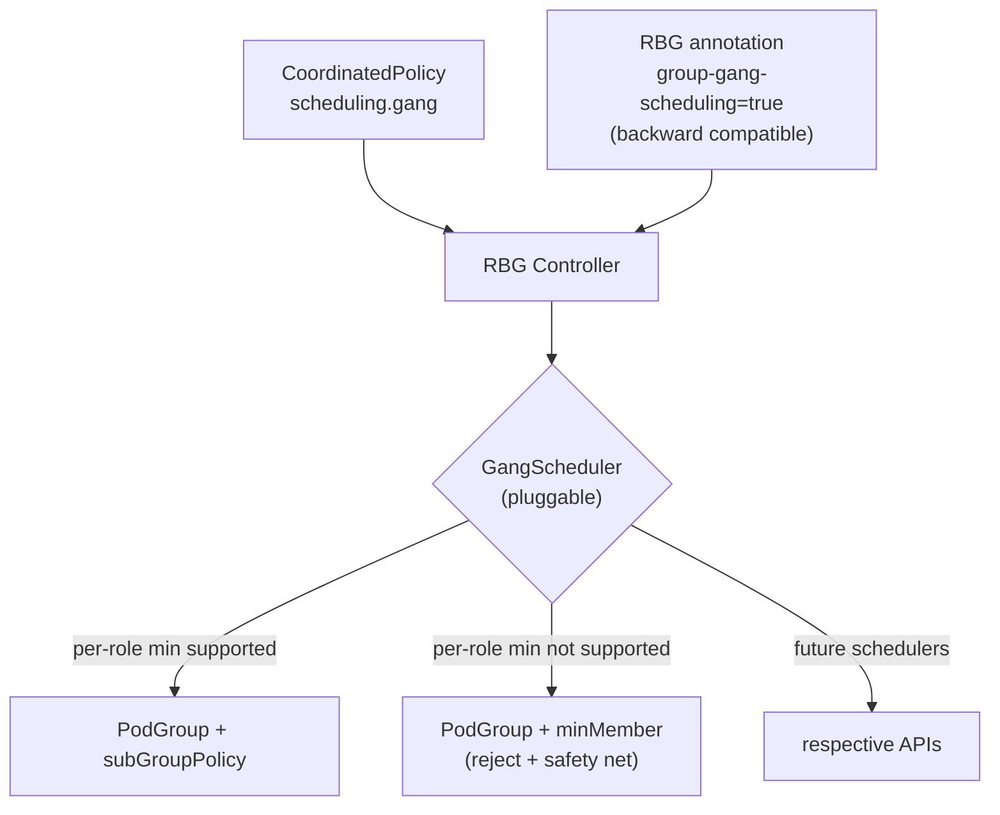

# KEP-430: Gang Scheduling

## Table of Contents

<!-- toc -->
- [Summary](#summary)
- [Motivation](#motivation)
    - [Goals](#goals)
    - [Non-Goals](#non-goals)
- [Proposal](#proposal)
    - [User Stories](#user-stories)
        - [Story 1: Partial Gang for PD-Disaggregated Inference](#story-1-partial-gang-for-pd-disaggregated-inference)
        - [Story 2: Basic Gang Scheduling](#story-2-basic-gang-scheduling)
    - [Design Overview](#design-overview)
    - [Risks and Mitigations](#risks-and-mitigations)
- [Design Details](#design-details)
    - [API: CoordinatedPolicy Scheduling Strategy](#api-coordinatedpolicy-scheduling-strategy)
    - [Scheduler Abstraction](#scheduler-abstraction)
    - [Webhook and Capability Validation](#webhook-and-capability-validation)
    - [Volcano Implementation (Reference)](#volcano-implementation-reference)
    - [Controller Flow](#controller-flow)
    - [GetGroupSize Enhancement](#getgroupsize-enhancement)
    - [Label and Annotation Conventions](#label-and-annotation-conventions)
    - [Backward Compatibility](#backward-compatibility)
    - [Test Plan](#test-plan)
        - [Unit tests](#unit-tests)
        - [Integration tests](#integration-tests)
        - [e2e tests](#e2e-tests)
    - [Graduation Criteria](#graduation-criteria)
    - [Upgrade / Downgrade Strategy](#upgrade--downgrade-strategy)
    - [Version Skew Strategy](#version-skew-strategy)
- [Drawbacks](#drawbacks)
- [Alternatives](#alternatives)
<!-- /toc -->

## Summary

This KEP introduces gang scheduling with optional per-role minimum configuration:

1. **Basic gang** (all-or-nothing): All pods created by the RBG must be scheduled simultaneously, otherwise all wait. This is the existing behavior, preserved for backward compatibility.
2. **Gang with per-role minimums**: Each role can specify a minimum number of replicas that must be scheduled as part of the gang, e.g., prefill must schedule at least 2 replicas, decode at least 1 replica. All specified minimums must be satisfied simultaneously for the gang to release. Roles not listed in the minimum configuration are excluded from gang constraints and scheduled normally.

This feature is configured via CoordinatedPolicy's `scheduling.gang` strategy. The RBG controller passes the strategy directly to the scheduler implementation (`GangScheduler`), which translates it into the scheduler's own API. The first complete implementation will support Volcano's subGroupPolicy, with extensibility for other schedulers in the future.

## Motivation

Currently, RBG's gang scheduling only supports basic all-or-nothing mode (minMember = total pod count), meaning all pods must be satisfied simultaneously or all wait.

In PD-disaggregated (Prefill-Decode disaggregated) inference scenarios, this "all-or-nothing" constraint is too strict:

1. **Cannot start when resources are insufficient**: Ideally deploy 4 prefill + 6 decode, but current resources are insufficient to schedule all 10 pods simultaneously, causing the service to fail to start entirely.
2. **Partial deployment is sufficient**: Only 2 prefill + 1 decode are needed to run the inference service, but the current minMember requires all pods to be scheduled, preventing service startup when resources are fragmented.
3. **Cross-role coordination needed**: Resources should not be used exclusively for prefill or decode; the minimum viable combination of both must be scheduled simultaneously.

### Goals

1. Implement RBG-level gang scheduling with optional per-role minimum configuration
2. Configure gang scheduling strategy via CoordinatedPolicy, unified with existing coordination mechanisms (RollingUpdate, Scaling)
3. Scheduler-agnostic API design with pluggable scheduler implementations
4. Backward compatibility: when `scheduling.gang` strategy is not configured, existing minMember-only behavior is preserved (annotation compatibility)

### Non-Goals

1. Implementing the scheduler itself
2. Cross-RBG gang scheduling coordination
3. Independent per-role gang scheduling (multiple PodGroups with independent release semantics). All roles configured in `minReplicas` share a single PodGroup and are evaluated atomically. Users needing independent gang scheduling should deploy separate RBGs.

## Proposal

A new `scheduling` coordination strategy domain is added to CoordinatedPolicy, where the `gang` sub-strategy controls gang scheduling for RBG's multiple roles. The `scheduling` domain can be extended in the future with other scheduling coordination strategies (e.g., topology, segment).

The strategy is read by the RBG controller and passed directly to the configured scheduler implementation, which translates it into scheduler-specific PodGroup configuration. The controller also automatically sets `pod.spec.schedulerName` to ensure pods are scheduled by the correct scheduler.

### User Stories

#### Story 1: Partial Gang for PD-Disaggregated Inference

Ideally, 4 prefill + 6 decode are desired, but current resources are insufficient. The service should still start:

1. A subset of prefill and decode can start the service (e.g., 2 prefill + 1 decode).
2. Both prefill and decode need a minimum number of instances; resources cannot be used exclusively for one role.

Configure CoordinatedPolicy:

```yaml
apiVersion: workloads.x-k8s.io/v1alpha2
kind: CoordinatedPolicy
metadata:
  name: inference-demo
spec:
  policies:
    - name: gang-scheduling
      roles: ["prefill", "decode"]
      strategy:
        scheduling:
          gang:
            minReplicas:
              prefill: 2
              decode: 1
```

Effect: The scheduler creates a single PodGroup for the RBG, where the prefill subgroup must have at least 2 complete replicas and the decode subgroup at least 1 complete replica. Both must be satisfied simultaneously for the gang to release any pods.

> **Note**: Per-role minimum gang requires scheduler support for this capability. Schedulers that do not support per-role minimums will have the CoordinatedPolicy creation rejected by the Webhook (see [Webhook and Capability Validation](#webhook-and-capability-validation)).

#### Story 2: Basic Gang Scheduling

The user only needs full gang scheduling (all pods scheduled simultaneously or all wait), without per-role minimum constraints:

```yaml
apiVersion: workloads.x-k8s.io/v1alpha2
kind: CoordinatedPolicy
metadata:
  name: inference-demo
spec:
  policies:
    - name: gang-scheduling
      roles: ["prefill", "decode"]
      strategy:
        scheduling:
          gang: {}  # gang sub-field presence enables gang scheduling, minMember = pods of the listed roles
```

The presence of the `scheduling.gang` sub-field enables gang scheduling. The rule's `roles` field scopes the gang: only those roles are enrolled in it. When `minReplicas` is empty, minMember equals the total number of pods across the covered roles, and all of them must be scheduled simultaneously. Roles left out of `roles` still receive the gang scheduler's `schedulerName`, so a single scheduler places the whole group, but they carry no PodGroup membership and do not contribute to minMember.

> **Backward compatibility**: RBGs without a CoordinatedPolicy, or with a CoordinatedPolicy that does not configure `scheduling.gang`, can still use the annotation `rbg.workloads.x-k8s.io/group-gang-scheduling: "true"` to enable basic gang scheduling. See [Backward Compatibility](#backward-compatibility).

### Design Overview



### Risks and Mitigations

| Risk | Mitigation |
|---|---|
| Scheduler does not support subGroupPolicy (e.g., scheduler-plugins) | Webhook rejects creation/update of CoordinatedPolicy with minReplicas |
| GetGroupSize inaccurate for CustomComponentsPattern | This KEP also fixes GetGroupSize to sum over components |
| minReplicas greater than role.replicas | Validated at reconcile: the PodGroup is not created/updated, `status.conditions` records `GangConfigured=False`, one `IncompatibleGangConfig` warning event is emitted on the transition, and the object is re-examined every 5 minutes; fixing either the policy or the replicas recovers immediately through the watches |
| No CoordinatedPolicy and no annotation | Gang scheduling not enabled |
| CoordinatedPolicy without scheduling.gang but with annotation | Annotation enables minMember-only gang (backward compatible) |

## Design Details

### API: CoordinatedPolicy Scheduling Strategy

A new `Scheduling` field is added to `CoordinatedPolicyStrategy`:

```go
// CoordinatedPolicyStrategy defines the strategy for coordinated roles.
type CoordinatedPolicyStrategy struct {
    // RollingUpdate defines the coordinated strategy for rolling updates.
    // +optional
    RollingUpdate *RollingUpdateCoordinationStrategy `json:"rollingUpdate,omitempty"`

    // Scaling defines the coordinated strategy for scaling operations.
    // +optional
    Scaling *ScalingCoordinationStrategy `json:"scaling,omitempty"`

    // Scheduling defines the coordinated strategy for scheduling.
    // Currently supports gang scheduling via the `gang` sub-field.
    // Future scheduling coordination strategies may be added.
    // +optional
    Scheduling *SchedulingCoordinationStrategy `json:"scheduling,omitempty"`
}
```

New `SchedulingCoordinationStrategy` (scheduling coordination domain) and `GangSchedulingStrategy` (gang sub-strategy):

```go
// SchedulingCoordinationStrategy defines scheduling coordination for roles.
// This is a domain that can hold multiple scheduling coordination strategies.
type SchedulingCoordinationStrategy struct {
    // Gang defines the gang scheduling coordination for roles.
    // When present, gang scheduling is enabled for the roles in this policy rule.
    //
    // When scheduling.gang is not configured (or CoordinatedPolicy does not
    // exist), the controller falls back to checking the legacy annotation
    // rbg.workloads.x-k8s.io/group-gang-scheduling=true for backward compatibility.
    // When neither is set, gang scheduling is disabled.
    //
    // +optional
    Gang *GangSchedulingStrategy `json:"gang,omitempty"`
}

// GangSchedulingStrategy defines gang scheduling parameters per role.
type GangSchedulingStrategy struct {
    // MinReplicas defines the minimum number of replicas per role
    // that must be scheduled together as part of the gang.
    //
    // When non-empty, only the roles listed in this map participate in
    // the gang with their respective minimums. Roles absent from this
    // map are excluded from gang constraints and scheduled normally,
    // though their pods still get the gang scheduler's schedulerName.
    //
    // When the gang field is present but minReplicas is empty (nil), the
    // gang is all-or-nothing over the roles the enclosing policy rule
    // lists, and minMember is their combined pod count.
    //
    // Several policy rules may each declare a gang strategy. The covered roles
    // are the union of every declaring rule's roles, and minReplicas maps are
    // merged across rules, taking the maximum when the same role appears more
    // than once. Roles covered only by an all-or-nothing rule participate in
    // full; the per-role minimums other rules declare still apply to the roles
    // those rules name.
    //
    // +optional
    MinReplicas map[string]int32 `json:"minReplicas,omitempty"`
}
```

**Validation rules**: See [Webhook and Capability Validation](#webhook-and-capability-validation).

### Scheduler Abstraction

#### Interface Changes

Existing `PodGroupManager` interface (`pkg/scheduler/podgroup_manager.go`):

```go
type PodGroupManager interface {
    ReconcilePodGroup(ctx, rbg, runtimeController, watchedWorkload, apiReader) error
    InjectPodGroupLabels(rbg, pts)
}
```

Renamed to `GangScheduler` (file `podgroup_manager.go` → `gang_scheduler.go`). Two changes: (1) `ReconcilePodGroup` gains a `gangStrategy` parameter; (2) `InjectPodGroupLabels` is renamed to `InjectPodSchedulingFields` and gains a `role` parameter. The implementation decides internally whether to use subGroupPolicy based on runtime capability detection:

```go
// GangScheduler encapsulates gang scheduling for a specific scheduler implementation.
// It manages both PodGroup lifecycle and pod-template field injection.
// Implementations are selected at controller startup based on the --scheduler-name flag.
type GangScheduler interface {
    // ReconcilePodGroup creates/updates/deletes the PodGroup for the given RBG.
    // gangStrategy is the strategy returned by common.GetGangStrategy, which resolves
    // the CoordinatedPolicy rules into the set of roles the gang covers plus their
    // per-role minimums. The legacy annotation resolves to a strategy covering every
    // role, so nil means gang is off.
    //
    // The implementation decides internally:
    // - gangStrategy == nil → gang disabled, delete any existing PodGroup
    // - gangStrategy != nil && MinReplicas empty → minMember = common.GangSize, the
    //   pod count of the covered roles (all-or-nothing over them)
    // - gangStrategy != nil && MinReplicas non-empty → subGroupPolicy (if supported)
    ReconcilePodGroup(
        ctx context.Context,
        rbg *workloadsv1alpha2.RoleBasedGroup,
        gangStrategy *common.GangStrategy,
        runtimeController *builder.TypedBuilder[reconcile.Request],
        watchedWorkload *sync.Map,
        apiReader client.Reader,
    ) error

    // InjectPodSchedulingFields injects scheduler-specific fields:
    // - the PodGroup annotation (Volcano) or label (scheduler-plugins) that ties the
    //   pod to its PodGroup, only for the roles the gang covers
    // - pod.spec.schedulerName, for every role, so a single scheduler owns the whole
    //   group. Volcano sets it unconditionally ("volcano"); scheduler-plugins sets it
    //   only when --scheduler-profile-name was given, since its profile name is chosen
    //   at deploy time.
    //
    // gangStrategy is nil when gang scheduling is not enabled, in which case
    // implementations must inject nothing.
    InjectPodSchedulingFields(
        rbg *workloadsv1alpha2.RoleBasedGroup,
        role *workloadsv1alpha2.RoleSpec,
        gangStrategy *common.GangStrategy,
        pts *coreapplyv1.PodTemplateSpecApplyConfiguration,
    )
}
```

Implementation changes:
- `pkg/scheduler/volcano/` — implements `GangScheduler`; uses a runtime `hasSubGroupPolicy` flag (set by inspecting the PodGroup CRD schema) to decide whether to emit subGroupPolicy
- `pkg/scheduler/k8s-scheduler-plugin/` — implements `GangScheduler`; minMember-only (PodGroup CRD has no subGroupPolicy field)

No interface split or type assertion is needed. The controller calls `ReconcilePodGroup` with the gangStrategy; the implementation handles the rest. The scheduler name is known at construction time (passed via `--scheduler-name` flag), so no `GetSchedulerName()` method is required on the interface.

#### Interface Migration Impact

The interface is renamed from `PodGroupManager` to `GangScheduler` (file `podgroup_manager.go` → `gang_scheduler.go`), and `InjectPodGroupLabels(rbg, pts)` is renamed to `InjectPodSchedulingFields(rbg, role, gangStrategy, pts)` with added `role *RoleSpec` and `gangStrategy *common.GangStrategy` parameters. Existing callers must be updated:

- `pkg/reconciler/pod_reconciler.go` — currently calls `r.podGroupManager.InjectPodGroupLabels(rbg, podTemplateApplyConfiguration)` in `buildPodTemplateSpec`. Update field name to `gangScheduler` and pass `role` as the second argument. The `role` variable is already in scope.
- `pkg/reconciler/roleinstanceset_reconciler.go` — holds a `podGroupManager` field via `SetPodGroupManager`. Rename to `gangScheduler` / `SetGangScheduler`. Verify whether its internal pod-template construction path also calls `InjectPodGroupLabels` and update accordingly.
- All scheduler implementations (`pkg/scheduler/volcano/`, `pkg/scheduler/k8s-scheduler-plugin/`) must implement the new method signature.
- Factory function `NewPodGroupManager(schedulerName, client)` → `NewGangScheduler(schedulerName, client)`.

The `role` parameter is needed because the gang covers only the roles its CoordinatedPolicy rules list, so only those roles should receive the PodGroup annotation or label. It matters even without `minReplicas`: an empty `minReplicas` is all-or-nothing over the covered roles, not over the whole group. Implementations still inject `schedulerName` for every role so a single scheduler owns the group. The legacy annotation is the case where every role is covered.

### Webhook and Capability Validation

Gang scheduling is a safety guarantee, not a convenience feature. When the scheduler does not support per-role minimums, **silent degradation is dangerous**: degrading to the gang minimum (Σ minReplicas × subGroupSize) lowers the gang threshold, allowing partial scheduling of wrong roles (e.g., all prefill, zero decode), which is less safe than not configuring gang scheduling at all.

Therefore, a **Webhook rejection** strategy is adopted: when `scheduling.gang.minReplicas` is non-empty in the CoordinatedPolicy and the current scheduler does not support per-role minimums, the Webhook directly rejects creation/update.

#### Admission Webhook

The Webhook runs in the same process as the controller (see `cmd/rbgs/main.go`), sharing the `--scheduler-name` startup parameter. Therefore, the Webhook can detect the current scheduler's capabilities at creation/update time, enabling proactive interception.

Implementation: the Webhook checks the `--scheduler-name` flag (shared in the same process) to determine scheduler capability. For `volcano`, per-role minimums are allowed (subject to runtime CRD schema check). For `scheduler-plugins`, per-role minimums are always rejected (PodGroup CRD has no subGroupPolicy field). This is consistent with the existing pattern of passing startup configuration to validators.

| Validation item | Rule | Failure behavior |
|---|---|---|
| `minReplicas` key validity | Each key must exist in the policy rule's `roles` list | Reject creation/update |
| `minReplicas` value range | Each value must be `> 0` | Reject creation/update |
| Scheduler capability | When `minReplicas` is non-empty and the scheduler does not support per-role minimums | Reject creation/update |

All validations above are self-contained: they depend only on the CoordinatedPolicy itself and on the process-wide `--scheduler-name`, so the Webhook reads no other resource.

#### Why Cross-CR Rules Are Validated at Reconcile, Not at Admission

Two rules span both CRs: a `minReplicas` key must name a role that exists in the RoleBasedGroup, and its value must not exceed that role's `replicas`. Neither is checked at admission.

1. **A policy states intent; the workload follows it.** Policy authoring should not be gated on the current shape of the workload, and a policy can be edited or removed at any time. A momentarily unsatisfiable `minReplicas` is therefore not an invalid write — it is a state in which the RoleBasedGroup is not yet schedulable, and either side may be the one that gets corrected.
2. **Cross-resource reads are expensive in a Webhook.** Each read costs an extra *uncached* apiserver request on every write (the Webhook serves before the informer cache is started, so a cached read fails with `ErrCacheNotStarted`). Worse, such a read has to fail open on a missing CRD, an RBAC gap or an apiserver hiccup, so it never provided a real guarantee in the first place.

Enforcement therefore lives in one place: `buildGangSpec` returns an `IncompatibleGangConfigError`, and the controller

- does not create or update the PodGroup;
- pauses role create/update. Without a PodGroup, a pod created now would carry the gang scheduler's `schedulerName` but no gang membership, so it would be placed on its own and hold its accelerators while the rest of the group waits — the outcome gang scheduling exists to prevent. Already-running pods are left alone, and cleanup of roles the user removed from the spec still runs, so a broken policy does not pin resources the user has released;
- records a `GangConfigured=False` condition with `reason=IncompatibleGangConfig` on the RoleBasedGroup;
- emits one `IncompatibleGangConfig` warning event, **only when the condition changes**;
- returns `RequeueAfter: 5m` instead of the error, keeping the object off the workqueue's 5ms-and-doubling error backoff.

The backoff and the edge triggering are deliberate. CR edits already re-enqueue through the CoordinatedPolicy and RoleBasedGroup watches, so a fast retry buys nothing there; the 5m requeue exists for the changes that do not re-enqueue, such as a Volcano upgrade or a `--scheduler-name` switch. Reconciles are also driven by churn on owned resources (RoleInstanceSet, Service, RoleBasedGroupScalingAdapter), so a level-triggered event would fire at the churn rate regardless of the requeue interval. That would hit the client-go event spam filter, which is keyed on object plus event type and *not* on reason, silencing every other warning on the same RoleBasedGroup. Making the condition the durable surface and the event the edge decouples the event count from the reconcile rate.

#### Why Not Degrade

| Approach | minMember | Actual behavior | Safety |
|---|---|---|---|
| Degrade to gang minimum | 6 | 6 pods (any role combination) are gang-scheduled, remaining pods scheduled independently afterward | ✗ More dangerous than not configuring: lowers gang threshold but loses role constraints |
| Reject creation | — | CoordinatedPolicy creation rejected, user must switch scheduler or remove minReplicas | ✓ Clear feedback |

Degrading to the gang minimum (6) lowers minMember from the full count (20 = 4×2 + 6×2), making partial scheduling easier — the scheduler might select 6 prefill pods to satisfy the gang, but zero decode pods are scheduled, which is exactly the scenario the user wants to avoid.

| Scheduler | Supports per-role minimums | Notes |
|---|---|---|
| Volcano | ✓ (if CRD has `subGroupPolicy`) | Runtime CRD schema check detects whether the installed Volcano version exposes the `subGroupPolicy` field. Requires Volcano ≥ 1.14. If the CRD lacks the field, the GangScheduler implementation returns an error and records a status condition |
| scheduler-plugins | ✗ | PodGroup only has `minMember` and `ScheduleTimeoutSeconds`; Webhook always rejects minReplicas |
| Future schedulers | Depends on implementation | Detected via CRD schema inspection or scheduler name |

#### Runtime Safety Net

For **scheduler capability**, the Webhook has normally already intercepted at creation time. But if the user switches `--scheduler-name` after creating the CoordinatedPolicy (e.g., from volcano to scheduler-plugins), or if the Volcano CRD is downgraded (losing `subGroupPolicy`), the controller detects during reconcile that `gangStrategy.MinReplicas` is non-empty while the current scheduler cannot support per-role minimums.

For the **cross-CR rules** (role existence, `minReplicas <= role.replicas`), reconcile is not a backstop but the only enforcement point.

Both cases take the same path:

- Does not create/update the PodGroup
- Records a `GangConfigured=False` condition with `reason=IncompatibleGangConfig` in RBG status conditions, and emits one warning event of the same reason when the condition changes
- Requeues after a fixed 5 minutes rather than returning an error
- Once the user fixes the configuration (switches the scheduler back, corrects the role name, adjusts replicas, or removes minReplicas), the watches re-enqueue immediately and the condition flips back to `True`

### Volcano Implementation (Reference)

The Volcano implementation translates `GangSchedulingStrategy` into Volcano PodGroup's `subGroupPolicy`:

```yaml
apiVersion: scheduling.volcano.sh/v1beta1
kind: PodGroup
metadata:
  name: inference-demo
  namespace: default
  ownerReferences:
  - apiVersion: workloads.x-k8s.io/v1alpha2
    kind: RoleBasedGroup
    name: inference-demo
    controller: true
  annotations:
    # Inherited from RBG annotations (filtered by volcano.sh/ prefix)
spec:
  minMember: 6                    # Σ(minSubGroups × subGroupSize) = 2×2 + 1×2
  queue: default
  subGroupPolicy:
  - name: prefill
    labelSelector:
      matchLabels:
        rbg.workloads.x-k8s.io/group-name: inference-demo
        rbg.workloads.x-k8s.io/role-name: prefill
    matchLabelKeys:
    - rbg.workloads.x-k8s.io/role-instance-name
    minSubGroups: 2
    subGroupSize: 2
  - name: decode
    labelSelector:
      matchLabels:
        rbg.workloads.x-k8s.io/group-name: inference-demo
        rbg.workloads.x-k8s.io/role-name: decode
    matchLabelKeys:
    - rbg.workloads.x-k8s.io/role-instance-name
    minSubGroups: 1
    subGroupSize: 2
```

Pod annotation injection (unchanged, Volcano hardcoded convention):

```yaml
# Pod annotation, Volcano scheduler recognizes this fixed key
scheduling.k8s.io/group-name: inference-demo
```

**Field mapping**:

| PodGroup field | Source | Notes |
|---|---|---|
| `spec.minMember` | Computed: Σ(minSubGroups × subGroupSize) | All covered roles: named roles at their minimums, all-or-nothing roles in full |
| `spec.queue` | RBG annotation `gang-scheduling-volcano-queue` | Inherits existing behavior |
| `spec.priorityClassName` | RBG annotation `gang-scheduling-volcano-priority` | Inherits existing behavior |
| `spec.subGroupPolicy[].name` | Covered role name | One entry per role the gang covers |
| `spec.subGroupPolicy[].minSubGroups` | `GangSchedulingStrategy.MinReplicas` value, or the role's replicas | All-or-nothing roles are held to their full replica count |
| `spec.subGroupPolicy[].subGroupSize` | `computeSubGroupSize(role)` | Computed from pattern |
| `spec.subGroupPolicy[].labelSelector` | Fixed convention | group-name + role-name |
| `spec.subGroupPolicy[].matchLabelKeys` | Fixed constant | role-instance-name |

### Controller Flow

```
RBG Reconcile
  │
  ├── 1. Fetch CoordinatedPolicy (by name, existing logic)
  │     policy := client.Get(name=rbg.Name, namespace=rbg.Namespace)
  │
  ├── 2. Determine if gang scheduling is enabled
  │     ├── CoordinatedPolicy has scheduling.gang strategy? → enabled
  │     ├── Otherwise check annotation compatibility
  │     │     rbg.annotations["rbg.workloads.x-k8s.io/group-gang-scheduling"] == "true"?
  │     │     → enabled (minMember-only)
  │     └── Neither satisfied → not enabled, skip PodGroup
  │
  ├── 3. Extract gang strategy
  │     gangStrategy := scheduling.gang strategy extracted from policy
  │     (union the `roles` of every gang rule into the set the gang covers; merge
  │      minReplicas across multiple rules, take maximum for overlapping roles
  │      — maximum is more conservative and aligns with the safety-first principle;
  │      taking the minimum would silently weaken gang constraints. A rule with an
  │      empty minReplicas is all-or-nothing over its roles: those roles participate
  │      in full, and any per-role minimum declared for them is subsumed. The
  │      resulting MinReplicas map is therefore a subset of the covered roles.)
  │
  ├── 4. Call scheduler interface
  │     gs.ReconcilePodGroup(ctx, rbg, gangStrategy, ...)
  │     // Implementation decides internally:
  │     //   - gangStrategy == nil → gang disabled, delete any existing PodGroup
  │     //   - MinReplicas empty → minMember = pod count of the covered roles
  │     //     (all-or-nothing over them; the legacy annotation covers every role)
  │     //   - MinReplicas non-empty + subGroupPolicy supported → PodGroup with subGroupPolicy:
  │     //     each named role is held to its minimum, covered roles absent from the map
  │     //     participate in full
  │     //   - MinReplicas non-empty + subGroupPolicy NOT supported → return error + status condition
  │     //     (runtime safety net: Webhook should have intercepted earlier)
  │
  └── 5. Scheduler implementation translates to scheduler-specific resources
```

#### computeSubGroupSize Logic

```go
func computeSubGroupSize(role *RoleSpec) int32 {
    if role.IsLeaderWorkerPattern() {
        lwp := role.GetLeaderWorkerPattern()
        if lwp != nil && lwp.Size != nil {
            return max(*lwp.Size, 1)
        }
        return 1
    }
    if role.GetCustomComponentsPattern() != nil {
        var total int32
        for _, c := range role.GetCustomComponentsPattern().Components {
            if c.Size != nil {
                total += *c.Size
            }
        }
        return max(total, 1)
    }
    // StandalonePattern or unspecified
    return 1
}
```

### GetGroupSize Enhancement

The current `GetGroupSize()` (`api/workloads/v1alpha2/helper.go`) only counts 1 pod/replica for non-LeaderWorkerPattern roles, and is inaccurate for CustomComponentsPattern.

After fix:

```go
func (rbg *RoleBasedGroup) GetGroupSize() int {
    ret := 0
    for _, role := range rbg.Spec.Roles {
        subGroupSize := int(computeSubGroupSize(&role))
        ret += subGroupSize * int(*role.Replicas)
    }
    return ret
}
```

#### Migration Impact

This fix changes `GetGroupSize()` return value for roles using `CustomComponentsPattern`. For example, a role with 2 components (each `size: 3`) and `replicas: 2`:

| | Before fix | After fix |
|---|---|---|
| Per-replica pod count | 1 | 6 (3+3) |
| minMember contribution | 2 (1×2) | 12 (6×2) |

Existing RBGs with `CustomComponentsPattern` that enable gang scheduling via the annotation will see their PodGroup `minMember` increase on the next reconcile after controller upgrade. However, **this does not affect already-running pods**: gang scheduling (PodGroup `minMember`) only governs scheduling decisions for pending pods — running pods are not evicted when `minMember` increases. The only observable effect is that future scheduling events (scale-up, pod crash-restart) will use the corrected, higher `minMember`, which is the intended behavior since the previous value was a bug (too low to enforce the gang constraint for the full group).

### Label and Annotation Conventions

**RBG gang scheduling enablement**:

| Key | Location | Description |
|---|---|---|
| `rbg.workloads.x-k8s.io/group-gang-scheduling` | RBG annotation | Set to "true" to enable. **Backward compatible**: CoordinatedPolicy `scheduling.gang` strategy takes priority; annotation is retained for users not using CoordinatedPolicy. When both exist, CoordinatedPolicy takes precedence |
| `rbg.workloads.x-k8s.io/group-gang-scheduling-volcano-queue` | RBG annotation | Optional, Volcano queue name. Uses Volcano default queue when not set |
| `rbg.workloads.x-k8s.io/group-gang-scheduling-volcano-priority` | RBG annotation | Optional, Volcano priority class. Uses default priority when not set |

**Pod labels** (existing, used by subGroupPolicy labelSelector):

| Key | Description |
|---|---|
| `rbg.workloads.x-k8s.io/group-name` | Identifies which RBG the pod belongs to |
| `rbg.workloads.x-k8s.io/role-name` | Identifies which role the pod belongs to |
| `rbg.workloads.x-k8s.io/role-instance-name` | Identifies which role replica the pod belongs to (used for subgroup partitioning) |

**Pod Spec fields** (controller-injected, new):

| Field | Description |
|---|---|
| `spec.schedulerName` | When gang scheduling is enabled, the controller sets this via `InjectPodSchedulingFields`. Volcano sets it unconditionally to `"volcano"`. scheduler-plugins sets it only when `--scheduler-profile-name` is given, because its kube-scheduler profile name is chosen at deploy time and defaults to the cluster default scheduler; with the flag empty, no `schedulerName` is injected. Users do not need to set it in the pod template. All pods of gang-covered roles get `schedulerName`; only gang-participating roles' pods additionally get the PodGroup annotation/label |

> **Rollout note**: `pod.spec.schedulerName` is set in the pod template by `InjectPodSchedulingFields` at the `PodReconciler` level. When gang scheduling is newly enabled on an existing RBG, only **newly created** pods pick up the correct `schedulerName`. Existing pods retain the default scheduler. To enforce gang scheduling on existing pods, the user must trigger a pod recreation (e.g., scale down and up, or restart the workload). Conversely, when gang scheduling is disabled, existing pods with `schedulerName` set will continue to use the gang scheduler until recreated.

**Pod annotations/labels** (existing, scheduler-specific):

| Key | Description |
|---|---|
| `scheduling.k8s.io/group-name` | Volcano scheduler's fixed Pod→PodGroup association annotation |
| `pod-group.scheduling.sigs.k8s.io/name` | Koordinator/ACK Pod→PodGroup association label |
| `scheduling.x-k8s.io/pod-group` | Upstream scheduler-plugins coscheduling label. Upstream does not recognise the key above, so both are set |

### Backward Compatibility

| Scenario | Behavior |
|---|---|
| No CoordinatedPolicy, no annotation | Gang scheduling not enabled |
| No CoordinatedPolicy, with annotation `group-gang-scheduling=true` | minMember = GetGroupSize(), full gang (backward compatible, existing behavior) |
| CoordinatedPolicy without scheduling.gang, with annotation | Same as above, annotation takes effect (backward compatible) |
| CoordinatedPolicy with scheduling.gang (`gang: {}`, no minReplicas) | minMember = pod count of the roles the rule lists, all-or-nothing over them (CoordinatedPolicy takes priority over annotation) |
| CoordinatedPolicy with scheduling.gang (with minReplicas) + scheduler supports per-role minimums | Pass GangSchedulingStrategy, enable gang with per-role minimums |
| CoordinatedPolicy with scheduling.gang (with minReplicas) + scheduler does not support per-role minimums | Webhook rejects creation/update |
| CoordinatedPolicy with existing rollingUpdate/scaling strategies | Coexists with scheduling.gang strategy, no interference |
| CoordinatedPolicy with scheduling.gang and annotation simultaneously | CoordinatedPolicy takes priority, annotation ignored |

### Test Plan

#### Unit tests

1. `computeSubGroupSize()` correctness for three patterns (Standalone, LeaderWorker, CustomComponents).
2. `GetGroupSize()` correctness for CustomComponentsPattern after fix.
3. Logic for extracting gang strategy from CoordinatedPolicy, including:
   - Single policy rule
   - Multiple policy rules with overlapping roles (take maximum)
   - Roles not in minReplicas do not participate in gang
   - Roles outside the rule's `roles` are not enrolled and do not count toward minMember
4. Coordinated scaling targets are raised to the gang minimum, so a role paced by `maxSkew` is never held below the replica count its gang waits for.
5. Volcano GangScheduler correctness in translating `GangSchedulingStrategy` to PodGroup subGroupPolicy.
6. Degrade to minMember-only when `minReplicas` is empty.
7. CRD schema inspection: `podGroupCRDHasSubGroup()` correctly detects `subGroupPolicy` field presence in the PodGroup CRD OpenAPI schema.
8. Webhook scheduler capability validation: CoordinatedPolicy with minReplicas rejected when `--scheduler-name` is `scheduler-plugins` (always rejected) or `volcano` without `subGroupPolicy` in CRD.

#### Integration tests

1. Create RBG + CoordinatedPolicy (with scheduling.gang strategy), verify PodGroup subGroupPolicy fields are correctly generated.
2. Update CoordinatedPolicy scheduling.gang strategy, verify PodGroup subGroupPolicy syncs.
3. Delete CoordinatedPolicy, verify PodGroup is deleted (or degrades to minMember-only if annotation compatibility is active).
4. Scheduler without subGroupPolicy support (simulating scheduler-plugins), verify CoordinatedPolicy with minReplicas is rejected by Webhook.

#### e2e tests

1. Under Volcano environment, configure minReplicas, verify partial pods are scheduled after gang is satisfied.
2. When resources are insufficient, verify all pods remain Pending, no partial scheduling.
3. Without scheduling.gang strategy, verify existing full gang behavior is unaffected (annotation compatibility path).

### Graduation Criteria

- [ ] API type definitions complete (SchedulingCoordinationStrategy + GangSchedulingStrategy)
- [ ] GetGroupSize fix complete
- [ ] Upgrade `volcano.sh/apis` dependency to ≥ v1.14.0 (required for `SubGroupPolicy` field)
- [ ] Volcano GangScheduler subGroupPolicy support implementation
- [ ] Interface evolution: rename `PodGroupManager` → `GangScheduler`, add `gangStrategy` parameter to `ReconcilePodGroup`, rename `InjectPodGroupLabels` → `InjectPodSchedulingFields` (no interface split needed)
- [ ] CRD schema inspection for `subGroupPolicy` capability detection (reference: [kthena podgroupmanager](https://github.com/volcano-sh/kthena/blob/main/pkg/model-serving-controller/podgroupmanager/manager.go))
- [ ] `InjectPodSchedulingFields` implementation (including pod.spec.schedulerName injection)
- [ ] Controller adaptation layer (CoordinatedPolicy → GangSchedulingStrategy) implementation
- [ ] Webhook validation implementation (including scheduler capability validation)
- [ ] Runtime safety net implementation (return error + RBG status condition on scheduler switch)
- [ ] Annotation backward compatibility path implementation
- [ ] Unit test coverage
- [ ] Integration test coverage
- [ ] e2e tests (Volcano environment)

### Upgrade / Downgrade Strategy

- **Upgrade**: The new `scheduling.gang` field is optional; existing CoordinatedPolicies without this field behave unchanged (annotation compatibility).
- **Downgrade**: After removing scheduling.gang strategy from CoordinatedPolicy, PodGroup degrades to minMember-only (or annotation compatibility path) on next reconcile. subGroupPolicy fields are cleared.

### Version Skew Strategy

- CoordinatedPolicy's `scheduling.gang` field is optional; when missing during cross-version conversion, behavior degrades to existing behavior (annotation compatibility path).

## Drawbacks

1. **Scheduler capability disparity**: Per-role minimum gang depends on scheduler support for subGroupPolicy (Volcano ≥ 1.14). When not supported, the Webhook rejects creation of CoordinatedPolicy with minReplicas. Users receive clear error feedback at creation time.
2. **Additional CoordinatedPolicy dependency**: Requires managing both RBG and CoordinatedPolicy CRs, adding configuration complexity. However, CoordinatedPolicy already has rollingUpdate/scaling strategies, and gang scheduling is a natural extension.

## Alternatives

### Alternative 1: RBG spec.gangPolicy

Add `gangPolicy` field to RBG spec:

```yaml
apiVersion: workloads.x-k8s.io/v1alpha2
kind: RoleBasedGroup
spec:
  gangPolicy:
    minRoleReplicas:
      prefill: 2
      decode: 1
  roles:
    - name: prefill
      replicas: 4
      leaderWorkerPattern:
        size: 2
```

**Pros**: Configuration is within RBG, no extra CR needed.

**Cons**: RBG's architectural layering is "spec defines roles, CoordinatedPolicy defines coordination strategies". Gang scheduling is a coordination strategy; putting it in spec breaks this layering. rollingUpdate and scaling are already in CoordinatedPolicy; putting gang alone in spec would scatter coordination strategies across two places.

### Alternative 2: Use Volcano `MinTaskMember` Instead of `SubGroupPolicy`

Volcano PodGroup already has a `MinTaskMember map[string]int32` field (available since v1.8) that defines the minimum number of pods per task. This could achieve per-role minimum constraints without requiring a Volcano upgrade to v1.14.

```yaml
spec:
  minMember: 6
  minTaskMember:
    prefill: 4
    decode: 2
```

**Pros**: No Volcano dependency upgrade needed; `MinTaskMember` is available in the currently vendored v1.12.2.

**Cons**: `MinTaskMember` does not support `subGroupSize` (the concept of grouping pods within a role by replica index), `labelSelector` for fine-grained pod matching, or `matchLabelKeys` for subgroup partitioning. Volcano's own API documentation states: "SubGroupPolicy covers all capabilities of minTaskMember, while providing richer network topology and Gang scheduling management capabilities. Recommend using SubGroupPolicy." Since the RBG gang scheduling model needs `subGroupSize` to correctly handle `LeaderWorkerPattern` and `CustomComponentsPattern` (where each replica produces multiple pods), `MinTaskMember` cannot express the full gang constraint. `SubGroupPolicy` is the correct choice.
