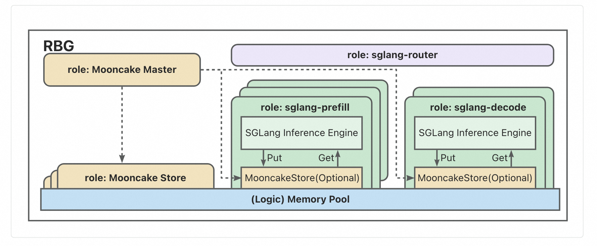

# KEP-74 Mooncake Integration
<!--
This is the title of your KEP. Keep it short, simple, and descriptive. A good
title can help communicate what the KEP is and should be considered as part of
any review.
-->

<!--
A table of contents is helpful for quickly jumping to sections of a KEP and for
highlighting any additional information provided beyond the standard KEP
template.

Ensure the TOC is wrapped with
  <code>&lt;!-- toc --&rt;&lt;!-- /toc --&rt;</code>
tags, and then generate with `hack/update-toc.sh`.
-->

<!-- toc -->
- [Motivation](#motivation)
- [Proposal](#proposal)
    - [User Stories](#user-stories-optional)
        - [Story 1](#story-1)
        - [Story 2](#story-2)
    - [Risks and Mitigations](#risks-and-mitigations)
- [Design Details](#design-details)
    - [Mooncake](#Mooncake)
    - [Mooncake Integration](#Mooncake-Integration)
    - [Benchmark](#benchmark)
- [Test Plan](#test-plan)
    - [Unit Tests](#unit-tests)
    - [Integration tests](#integration-tests)
    - [End to End Tests](#end-to-end-tests)
<!-- /toc -->

## Motivation

<!--
This section is for explicitly listing the motivation, goals, and non-goals of
this KEP.  Describe why the change is important and the benefits to users. The
motivation section can optionally provide links to [experience reports] to
demonstrate the interest in a KEP within the wider Kubernetes community.

[experience reports]: https://github.com/golang/go/wiki/ExperienceReports
-->

Mooncake Store is a distributed KVCache storage engine specifically designed for inference with large language models (LLM) based on Transfer Engine. It is a central component in the KVCache-centric distributed architecture. The goal of Mooncake Store is to store reusable KV caches at various locations within the inference cluster. Mooncake Store is already supported by SGLang's Hierarchical KV Caching and vLLM's prefill serving. It is now integrated with LMCache to provide enhanced KVCache management capabilities.

With the KV cache capabilities of Mooncake Store, service SLO metrics can be effectively improved in certain scenarios. Currently, Mooncake supports multi-replica deployment, storing multiple data replicas for the same object, effectively mitigating hot spot issues under access pressure. Additionally, Mooncake supports striping and parallel I/O transfer for large objects, fully utilizing aggregated bandwidth across multiple network cards (NICs) for high-speed data reading and writing.

This KEP aims to integrate Mooncake as a role in the RBG-deployed SGLang inference service, providing KVCache offload capabilities for the inference service.

## Proposal

<!--
This is where we get down to the specifics of what the proposal actually is.
This should have enough detail that reviewers can understand exactly what
you're proposing, but should not include things like API designs or
implementation. What is the desired outcome and how do we measure success?.
The "Design Details" section below is for the real
nitty-gritty.
-->

### User Stories (Optional)

<!--
Detail the things that people will be able to do if this KEP is implemented.
Include as much detail as possible so that people can understand the "how" of
the system. The goal here is to make this feel real for users without getting
bogged down.
-->

#### Story 1

As an inference service provider, I want to leverage Mooncake to provision a distributed memory pool for storing reusable KVCache, while also enabling flexible offload across KVCache tiers. This will effectively improve service SLOs in certain scenarios, such as multi-turn conversations.

#### Story 2
As an application operator, I hope to have a workload that can help me deploy the inference service while simultaneously deploying the external KVCache store service. This workload should facilitate service discovery between the inference service and the KVCache store service, control the startup sequence, and enable lossless updates.

### Risks and Mitigations

<!--
What are the risks of this proposal, and how do we mitigate? Think broadly.
For example, consider both security and how this will impact the larger
Kubernetes ecosystem.

How will security be reviewed, and by whom?

How will UX be reviewed, and by whom?

Consider including folks who also work outside the SIG or subproject.
-->

- **Availability**: By introducing a dependent external component into the inference service, the unavailability of that component may impact the overall availability of the service.
  - Mitigation: Mooncake Master supports high availability via multi-replica deployments backed by etcd. Moreover, Mooncake ensures that even if the Master becomes unavailable, the inference service can automatically degrade and continue operating using localized KVCache storage, thereby maintaining overall service availability.


## Design Details

<!--
This section should contain enough information that the specifics of your
change are understandable. This may include API specs (though not always
required) or even code snippets. If there's any ambiguity about HOW your
proposal will be implemented, this is the place to discuss them.
-->

### Mooncake
Mooncake, as the high-performance L3 storage backend for SGLang HiCache, enables cross-node distributed KV cache storage via RDMA-accelerated data transfer. This integration provides a virtually unlimited cache capacity through a distributed memory pool, overcoming the capacity limits of traditional GPU-only or GPU+CPU caches.

When the L1 and L2 caches miss, HiCache automatically retrieves the required KV cache from Mooncake’s distributed cache. The system employs intelligent prefetching to minimize latency and leverages RDMA and zero-copy techniques to ensure high-bandwidth, low-latency data transfer between SGLang instances and Mooncake storage nodes.

### Mooncake-Integration

#### Topology & Role Desgin



In the topology diagram shown above, there are five roles:

| Component                                     | Description                                                                                                                                                                                                                                                                                                         |
|-----------------------------------------------|---------------------------------------------------------------------------------------------------------------------------------------------------------------------------------------------------------------------------------------------------------------------------------------------------------------------|
| mooncake-master                               | Manages the logical storage pool and handles node join/leave events of mooncake store. Responsible for object-space allocation and metadata maintenance. Its memory allocation and eviction policies are purpose-built and optimized specifically for the demands of large language model (LLM) inference workloads. |
| mooncake-store                                | Provides memory exclusively for storage. Instances in this role are not permitted to initiate KVCache operations such as Get or Put requests; they serve purely as passive storage nodes.                                                                                                                           |
| sglang-router [Optional]                      | Orchestrates request routing and load balancing across the system. It directs incoming requests to appropriate sglang-prefill or sglang-decode instances, coordinates handoff between prefill and decode stages, and ensures efficient, consistent access to KVCache data via the Mooncake storage layer.           |
| sglang-engine [sglang-prefill, sglang-decode] | Integrates an inference engine along with a Mooncake store. The embedded Mooncake store supports multiple modes, including Client-Only mode, which does not allocate local memory for caching and operates solely as a client issuing KVCache Put/Get requests.    |


#### Deploy standalone inference service with mooncake

By following the steps below, you can create a SGLang inference service with three Mooncake store replicas, each provisioned with 10Gi of memory, serving as the distributed L3 KVCache storage.
```yaml
apiVersion: workloads.x-k8s.io/v1alpha1
kind: RoleBasedGroup
metadata:
  name: sglang-demo
spec:
  roles:
    - name: mooncake-master
      replicas: 1
      template:
        spec:
          containers:
            - name: master
              image: lmsysorg/sglang:v0.5.3.post1
              env:
                - name: POD_IP
                  valueFrom:
                    fieldRef:
                      fieldPath: status.podIP
              command:
                - sh
                - -c
                - "mooncake_master \
                --rpc_address $(POD_IP) --rpc_port 50051 \
                --http_metadata_server_host $(POD_IP) --http_metadata_server_port 8080 \
                --metrics_port 9003"
              ports:
                - containerPort: 8080
                  name: http
              readinessProbe:
                initialDelaySeconds: 10
                periodSeconds: 10
                tcpSocket:
                  port: 8080
    - name: mooncake-store
      replicas: 3
      template:
        spec:
          containers:
            - name: store
              image: lmsysorg/sglang:v0.5.3.post1
              env:
                - name: MOONCAKE_MASTER
                  value: "s-sglang-demo-mooncake-master:50051"
                - name: MOONCAKE_TE_META_DATA_SERVER
                  value: "http://s-sglang-demo-mooncake-master:8080/metadata"
                - name: MOONCAKE_GLOBAL_SEGMENT_SIZE
                  value: "50gb"
                # MOONCAKE_LOCAL_BUFFER_SIZE is set to 0 because the instance functions solely as a storage server, 
                # contributing memory to the global pool without issuing any request operations.
                - name: MOONCAKE_LOCAL_BUFFER_SIZE
                  value: "4194304"
                - name: MOONCAKE_PROTOCOL
                  value: "tcp" #support tcp, rdma
                - name: MOONCAKE_DEVICE
                  value: "" #set rdma device if MOONCAKE_PROTOCOL=rdma is set
              command:
                - sh
                - -c
                - "python -m mooncake.mooncake_store_service --port 8080"
              ports:
                - containerPort: 8080
                  name: http
              readinessProbe:
                initialDelaySeconds: 10
                periodSeconds: 10
                tcpSocket:
                  port: 8080
              resources:
                limits:
                  memory: "50Gi"
                  #configure rdma device if MOONCAKE_PROTOCOL=rdma is set
                  #rdma/hca: "1"
                requests:
                  memory: "50Gi"
                  #configure rdma device if MOONCAKE_PROTOCOL=rdma is set
                  #rdma/hca: "1"
    - name: sglang-backend
      dependencies: [ "mooncake-master" ]
      replicas: 1
      template:
        spec:
          volumes:
            - name: model
              persistentVolumeClaim:
                claimName: llm-model-qwen3
            - name: dshm
              emptyDir:
                medium: Memory
                sizeLimit: 15Gi
          containers:
            - name: sglang
              image: lmsysorg/sglang:v0.5.3.post1
              env:
                - name: MOONCAKE_MASTER
                  value: "s-sglang-demo-mooncake-master:50051"
                - name: MOONCAKE_TE_META_DATA_SERVER
                  value: "http://s-sglang-demo-mooncake-master:8080/metadata"
                # MOONCAKE_GLOBAL_SEGMENT_SIZE is set to 0 means that
                # the SGLang server will not contribute any memory to the system.
                - name: MOONCAKE_GLOBAL_SEGMENT_SIZE
                  value: "0"
                - name: MOONCAKE_LOCAL_BUFFER_SIZE
                  value: "4194304"
                - name: MOONCAKE_PROTOCOL
                  value: "tcp" #support tcp, rdma
                - name: MOONCAKE_DEVICE
                  value: "" #configure rdma device when MOONCAKE_PROTOCOL=rdma set
              command:
                - sh
                - -c
                - "python -m sglang.launch_server --model-path /models/Qwen3-32B/ \
                --host 0.0.0.0 --port 8000 \
                --enable-hierarchical-cache --hicache-storage-backend mooncake"
              ports:
                - containerPort: 8000
                  name: http
              readinessProbe:
                initialDelaySeconds: 30
                periodSeconds: 10
                tcpSocket:
                  port: 8000
              resources:
                limits:
                  nvidia.com/gpu: "1"
                  #configure rdma device if MOONCAKE_PROTOCOL=rdma set
                  #rdma/hca: "1"
                requests:
                  nvidia.com/gpu: "1"
                  #configure rdma device if MOONCAKE_PROTOCOL=rdma set
                  #rdma/hca: "1"
              volumeMounts:
                - mountPath: /models/Qwen3-32B
                  name: model
                - mountPath: /dev/shm
                  name: dshm
---
apiVersion: v1
kind: Service
metadata:
  labels:
    app: sglang-demo
  name: sglang-demo
spec:
  ports:
    - name: http
      port: 8000
      protocol: TCP
      targetPort: 8000
  selector:
    rolebasedgroup.workloads.x-k8s.io/name: sglang-demo
    rolebasedgroup.workloads.x-k8s.io/role: worker
  type: ClusterIP
```

Environments and Parameters Explanation:

- Role:mooncake-master
  - **rpc_port** (type: int32 default: 0): Port for RPC server to listen on.
  - **rpc_address** (type: string default: "0.0.0.0"): Address for RPC server to bind to)
  - **enable_http_metadata_server** (boolean, default: false): Enables the built-in HTTP metadata server instead of using etcd. When set to true, the master service will start an embedded HTTP server that handles metadata operations.
  - **http_metadata_server_port** (integer, default: 8080): Specifies the TCP port on which the HTTP metadata server will listen for incoming connections. This port must be available and not conflict with other services.
  - **http_metadata_server_host** (string, default: "0.0.0.0"): Specifies the host address for the HTTP metadata server to bind to. Use "0.0.0.0" to listen on all available network interfaces, or specify a specific IP address for security purposes.


- Role:mooncake-store and Role:sglang-backend
  - MOONCAKE_MASTER: The network address of the master service. The default port is 50051.
  - MOONCAKE_TE_META_DATA_SERVER: The network address of the metadata service. The default port is 8080.
  - MOONCAKE_GLOBAL_SEGMENT_SIZE: The amount of memory contributed to the global memory pool. Accepts either bytes (integer) or a string with the gb suffix, e.g., "16gb". A larger value allows Mooncake to cache more KV tensors.
    - If MOONCAKE_GLOBAL_SEGMENT_SIZE is set to zero, the instance functions as a pure client, issuing requests but not contributing memory to the system.
  - MOONCAKE_LOCAL_BUFFER_SIZE: Local buffer is used to do request operations such as Get or Put.
    - If MOONCAKE_LOCAL_BUFFER_SIZE is set to zero, it acts as a pure server, providing memory for storage. In this case, request operations such as Get or Put are not permitted from this instance.
  - MOONCAKE_PROTOCOL: The protocol used by Mooncake. Supported values are "rdma" or "tcp". For optimal performance, "rdma" is recommended.  
  - MOONCAKE_DEVICE: For "rdma", you can leave this empty in most cases. Mooncake auto-discovers RDMA NICs by default. If you want to pin specific NICs (e.g., mlx5_0,mlx5_1), just set device_name accordingly. To list available devices, use ibv_devices.


By inspecting the mooncake-master pod logs, you can see that the master has discovered three stores, which together provide 150Gi of KVCache storage.
```bash
kubectl logs sglang-demo-mooncake-master-0
```

```log
I1023 07:19:21.542047   228 rpc_service.cpp:40] Master Metrics: Storage: 0 B / 30.00 GB (0.0%) | Keys: 0 (soft-pinned: 0) 
```

Use the following commands to test service availability.

```bash
kubectl port-forward svc/sglang-demo 8000:8000

curl localhost:8000/v1/chat/completions \
  -H "Content-Type: application/json" \
  -d '{
    "model": "/models/Qwen3-32B",
    "messages": [
    {
        "role": "user",
        "content": "Explain why Roger Federer is considered one of the greatest tennis players of all time"
    }
    ],
    "max_tokens": 30
  }'
```


### Benchmark

We create two SGLang inference services—one with Mooncake enabled and one without—keeping the engine configuration and GPU resources identical. This setup is used to validate the impact of KVCache offloading on service SLOs in multi-turn conversation scenarios.

- Benchmark configuration:
  - Model: Qwen3-32B
  - Mooncake TransferEngine version: v0.3.6.post1
  - SGLang engine version: v0.5.3.post1
  - L3 Cache configuration: CPU RAM: 30Gi (3 × 10Gi)
  - Benchmark tool: SGLang bench_serving
  - Test method: Use the script below to run multi-turn benchmarks on both SGLang services and compare SLO metrics in the multi-turn conversation scenario.

    ```bash
    python3 -m sglang.bench_serving --backend sglang-oai \
    --num-prompts 300 --random-input 2048 \
    --random-output 512 --random-range-ratio 0.5 \
    --host 0.0.0.0 --port 8000 --model /models/Qwen3-32B/ \
    --dataset-path ShareGPT_V3_unfiltered_cleaned_split.json \
    --request-rate 10 \
    --seed 43
    ```
  

- Benchmark result
  - First-turn result

|              | Total token throughput | Mean TTFT	 | Mean ITL|
|--------------------------|------| ------| ------|
| Service without Mooncake | 1300.41 | 4808.37  |  162.69 | 
| Service with Mooncake           |  1352.45   |  5016.66 | 157.70 |
  - Multi-turn result

|              | Total token throughput       | Mean TTFT	                 | Mean ITL                  |
|--------------------------|------------------------------|----------------------------|---------------------------|
| Service without Mooncake | 1384.64                      | 1172.21                    | 139.95                    | 
| Service with Mooncake           | 1935.69 (improved by 39.80%) | 94.50 (improved by 91.94%) | 57.62 (improved by 58.83) |


From the benchmark results, we observe that the two services have comparable SLOs in the first turn. However, in subsequent multi-turn conversations, the Mooncake-enabled inference service benefits from larger KVCache capacity; by reusing KVCache stored in the Mooncake store, it avoids recomputation and significantly reduces time-to-first-token (TTFT).

By revisiting the mooncake-master logs at this point, we can see that 26.96Gi of KVCache has already been offloaded to the Mooncake store.

```bash
kubectl logs sglang-demo-mooncake-master-0
```

```log
I1023 07:23:53.873219   228 rpc_service.cpp:40] Master Metrics: Storage:26.96 / 30.00 GB (0.0%) | Keys: 219474 (soft-pinned: 0) 
```

### Test Plan

<!--
**Note:** *Not required until targeted at a release.*
The goal is to ensure that we don't accept enhancements with inadequate testing.

All code is expected to have adequate tests (eventually with coverage
expectations). Please adhere to the [Kubernetes testing guidelines][testing-guidelines]
when drafting this test plan.

[testing-guidelines]: https://git.k8s.io/community/contributors/devel/sig-testing/testing.md
-->

[X] I/we understand the owners of the involved components may require updates to
existing tests to make this code solid enough prior to committing the changes necessary
to implement this enhancement.


#### Unit Tests

<!--
In principle every added code should have complete unit test coverage, so providing
the exact set of tests will not bring additional value.
However, if complete unit test coverage is not possible, explain the reason of it
together with explanation why this is acceptable.
-->

<!--
Additionally, try to enumerate the core package you will be touching
to implement this enhancement and provide the current unit coverage for those
in the form of:
- <package>: <date> - <current test coverage>

This can inform certain test coverage improvements that we want to do before
extending the production code to implement this enhancement.
-->

#### Integration tests

<!--
Describe what tests will be added to ensure proper quality of the enhancement.

After the implementation PR is merged, add the names of the tests here.
-->

#### End to End Tests


## Alternatives

<!--
What other approaches did you consider, and why did you rule them out? These do
not need to be as detailed as the proposal, but should include enough
information to express the idea and why it was not acceptable.
-->
