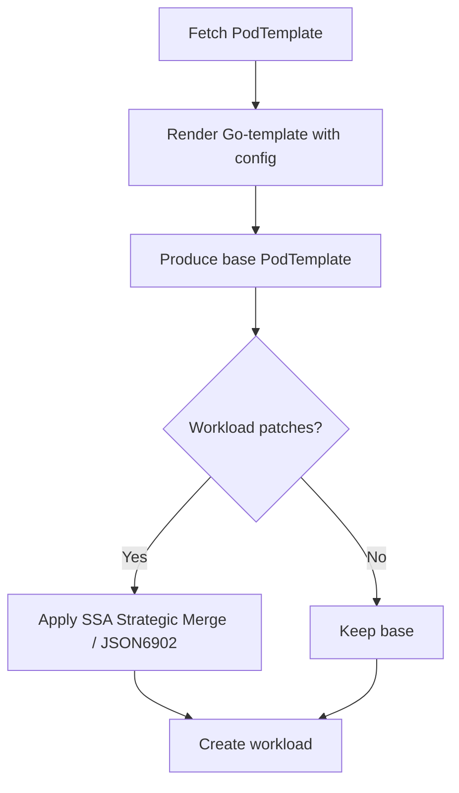

# KEP-8 Introduce template reference to reduce YAML duplication
<!--
This is the title of your KEP. Keep it short, simple, and descriptive. A good
title can help communicate what the KEP is and should be considered as part of
any review.
-->

<!--
A table of contents is helpful for quickly jumping to sections of a KEP and for
highlighting any additional information provided beyond the standard KEP
template.

Ensure the TOC is wrapped with
  <code>&lt;!-- toc --&rt;&lt;!-- /toc --&rt;</code>
tags, and then generate with `hack/update-toc.sh`.
-->

<!-- toc -->
- [Motivation](#motivation)
- [Proposal](#proposal)
    - [User Stories (Optional)](#user-stories-optional)
        - [Story 1](#story-1)
    - [Risks and Mitigations](#risks-and-mitigations)
- [Design Details](#design-details)
    - [Implementation](#implementation)
    - [Test Plan](#test-plan)
        - [Unit Tests](#unit-tests)
        - [Integration tests](#integration-tests)
        - [End to End Tests](#end-to-end-tests)
<!-- /toc -->

## Motivation

<!--
This section is for explicitly listing the motivation, goals, and non-goals of
this KEP.  Describe why the change is important and the benefits to users. The
motivation section can optionally provide links to [experience reports] to
demonstrate the interest in a KEP within the wider Kubernetes community.

[experience reports]: https://github.com/golang/go/wiki/ExperienceReports
-->

Large language-model (LLM) services currently suffer from:

1. **Configuration explosion** – every role carries long commands and dozens of env vars.  
2. **Copy-paste errors** – staging vs. prod values are changed by hand.  
3. **Cross-team friction** – platform teams cannot push base-image or probe fixes without forcing every service owner to re-copy YAML.  

### Goals

- **Reduce configuration complexity:** Allow users to define workloads with minimal YAML (target ≤ 40 lines) by leveraging templates and variable injection.
- **Improve consistency and reliability:** Centralize common configurations in a shared PodTemplate CRD, reducing copy-paste errors and ensuring uniformity.
- **Support advanced use cases:** Provide patch mechanisms (e.g., patchLeaderTemplate) for expert users to customize rendered templates.

### Non-Goals

- Initially support non-LeaderWorkerSet (LWS) workloads, though the design may be extended in the future.

## Proposal

<!--
This is where we get down to the specifics of what the proposal actually is.
This should have enough detail that reviewers can understand exactly what
you're proposing, but should not include things like API designs or
implementation. What is the desired outcome and how do we measure success?.
The "Design Details" section below is for the real
nitty-gritty.
-->
We propose a new CRD RoleBasedGroup that references a centralized `PodTemplate` CRD. The PodTemplate contains a Go Template for the pod specification and default values for variables. The `RoleBasedGroup` injects role-specific variables and optionally applies patches to the rendered template.

### User Stories (Optional)

<!--
Detail the things that people will be able to do if this KEP is implemented.
Include as much detail as possible so that people can understand the "how" of
the system. The goal here is to make this feel real for users without getting
bogged down.
-->

#### Story 1

An application team needs to deploy a service with leader and worker roles. They use a shared PodTemplate and specify only the differences (e.g., replica counts, resource limits) in their RoleBasedGroup. This simplifies their configuration and ensures they benefit from platform-wide updates.


### Risks and Mitigations

<!--
What are the risks of this proposal, and how do we mitigate? Think broadly.
For example, consider both security and how this will impact the larger
Kubernetes ecosystem.

How will security be reviewed, and by whom?

How will UX be reviewed, and by whom?

Consider including folks who also work outside the SIG or subproject.
-->
- **Security**: Go Template functions could be exploited. Mitigation: Restrict available functions to a safe subset and validate variables against a schema.  
- **Performance**: Rendering templates for many workloads might add overhead. Mitigation: Implement caching and rate limiting.  
- **Complexity**: The rendering and patching logic might be hard to debug. Mitigation: Provide detailed logging and status conditions.

## Design Details


<!--
This section should contain enough information that the specifics of your
change are understandable. This may include API specs (though not always
required) or even code snippets. If there's any ambiguity about HOW your
proposal will be implemented, this is the place to discuss them.
-->
### API

#### PodTemplate CRD
```yaml
apiVersion: workloads.x-k8s.io/v1alpha1
kind: PodTemplate
metadata:
  name: sglang-default
spec:
  defaults:               # fallback values
    mode: prefill
    tp: "1"
    dp: "1"
    max_running: "512"
    ib_devices: mlx5_0,mlx5_1
  template:
    metadata:
      labels:
        app: sglang
        pd_role: "{{ .mode }}"
    spec:
      hostNetwork: true
      containers:
      - name: sglang
        image: sealos.hub:5000/sglang:{{ .image_tag | default "v0.5.1.post1-cu126" }}
        command:
        - python3
        - -m
        - sglang.launch_server
        - --tp={{ .tp }}
        - --dp={{ .dp }}
        - --disaggregation-mode={{ .mode }}
        - --max-running-requests={{ .max_running }}
        resources:
          requests:
            nvidia.com/gpu: "{{ .tp }}"
```

#### RoleBasedGroup CRD
```yaml
apiVersion: workloads.x-k8s.io/v1alpha1
kind: RoleBasedGroup
metadata:
  name: deepseek-rbg
spec:
  roles:
  - name: prefill
    replicas: 4
    workloadRef:
      apiVersion: leaderworkerset.x-k8s.io/v1
      kind: LeaderWorkerSet
      lws:
        size: 4
        patchLeaderTemplate:
          spec:
            containers:
            - name: sglang
              command:
              - --port=30000
        patchWorkerTemplate:
          spec:
            containers:
            - name: sglang
              resources:
                requests:
                  memory: "32Gi"
              command:
                - --crash-dump-folder /log
    templateRef:
      apiVersion: workloads.x-k8s.io/v1alpha1
      kind: PodTemplate
      name: sglang-default
      propagation: Static   # or Rolling
      config:
        mode: prefill
        tp: "4"
        dp: "4"
        max_running: "2048"
```

#### Rendering & Merge Flow 

Controller Behavior

1. Read RoleBasedGroup: For each role, get the referenced PodTemplate.  
2. Render Template: Use Go Template rendering with variables from config and default values from parameters.  
3. Apply Patches: If provided, apply patchLeaderTemplate and patchWorkerTemplate using strategic merge.  
4. Create Workload: Generate the final LeaderWorkerSet (or other workload) and submit to the APIServer.  




Priority (high → low):  
`patchLeader/Worker` > `templateRef.config` > `ClusterPodTemplate.defaults`.

### Upgrade Strategies

| Strategy | Template Change | Workload Action | Trigger |
|---|---|---|---|
| **Static** (default) | new version | none (manual rollout) | `kubectl rollout restart` |
| **Rolling** | new version | rolling update | controller |

### Test Plan

<!--
**Note:** *Not required until targeted at a release.*
The goal is to ensure that we don't accept enhancements with inadequate testing.

All code is expected to have adequate tests (eventually with coverage
expectations). Please adhere to the [Kubernetes testing guidelines][testing-guidelines]
when drafting this test plan.

[testing-guidelines]: https://git.k8s.io/community/contributors/devel/sig-testing/testing.md
-->

[X] I/we understand the owners of the involved components may require updates to
existing tests to make this code solid enough prior to committing the changes necessary
to implement this enhancement.


#### Unit Tests

- Test template rendering with various variables.
- Test patch application logic.
- Test validation of parameters.

<!--
In principle every added code should have complete unit test coverage, so providing
the exact set of tests will not bring additional value.
However, if complete unit test coverage is not possible, explain the reason of it
together with explanation why this is acceptable.
-->

<!--
Additionally, try to enumerate the core package you will be touching
to implement this enhancement and provide the current unit coverage for those
in the form of:
- <package>: <date> - <current test coverage>

This can inform certain test coverage improvements that we want to do before
extending the production code to implement this enhancement.
-->

#### Integration tests

- Test the entire flow from RoleBasedGroup to rendered workload.
- Test rolling update propagation.

<!--
Describe what tests will be added to ensure proper quality of the enhancement.

After the implementation PR is merged, add the names of the tests here.
-->

#### End to End Tests

- Deploy a sample application using RoleBasedGroup and verify functionality.
- Test upgrade of PodTemplate and verify rolling update.


## Implementation History

- **2025-09-02**: Initial draft of KEP.


## Alternatives

<!--
What other approaches did you consider, and why did you rule them out? These do
not need to be as detailed as the proposal, but should include enough
information to express the idea and why it was not acceptable.
-->

- Helm: Helm charts can template configurations, but they are not dynamically updatable without a release process.
- Kustomize: Kustomize supports patching but lacks centralized template management and variable injection.
