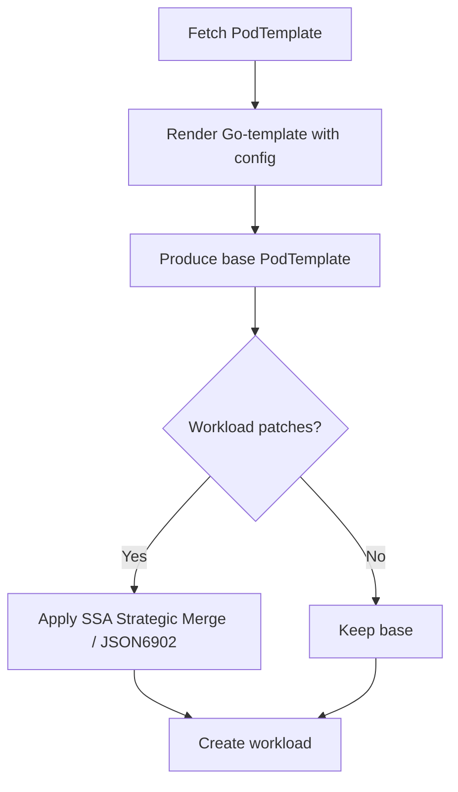

# KEP-8 Introduce template reference to reduce YAML duplication
<!--
This is the title of your KEP. Keep it short, simple, and descriptive. A good
title can help communicate what the KEP is and should be considered as part of
any review.
-->

<!--
A table of contents is helpful for quickly jumping to sections of a KEP and for
highlighting any additional information provided beyond the standard KEP
template.

Ensure the TOC is wrapped with
  <code>&lt;!-- toc --&rt;&lt;!-- /toc --&rt;</code>
tags, and then generate with `hack/update-toc.sh`.
-->

<!-- toc -->
- [Summary](#summary)
- [Motivation](#motivation)
- [Proposal](#proposal)
    - [User Stories (Optional)](#user-stories-optional)
        - [Story 1](#story-1)
        - [Story 2](#story-2)
    - [Risks and Mitigations](#risks-and-mitigations)
- [Design Details](#design-details)
    - [Implementation](#implementation)
    - [Test Plan](#test-plan)
        - [Unit Tests](#unit-tests)
        - [Integration tests](#integration-tests)
        - [End to End Tests](#end-to-end-tests)
<!-- /toc -->

## Summary

This KEP proposes a new custom resource definition (CRD) called `RoleBasedGroup` to simplify the management of multi-role workloads in Kubernetes. It addresses configuration duplication, environment-specific variations, and upgrade complexities by introducing a template-based approach with variable substitution and patch mechanisms.

The `RoleBasedGroup` CRD provides a higher-level abstraction for managing applications with multiple roles (e.g., leader-worker patterns) while maintaining compatibility with existing Kubernetes workload resources. It enables centralized configuration management through reusable templates, reduces human error through variable substitution, and simplifies upgrades through a unified configuration approach.

## Motivation

Managing multi-role workloads in Kubernetes presents several challenges:

1. **Configuration Explosion**: Each role requires maintaining lengthy command lines and numerous environment variables, resulting in YAML files exceeding 200+ lines.
2. **Copy-Paste Errors**: Manual modifications for different environments (staging/production) often lead to missed or incorrect changes.
3. **Upgrade Complexity**: Duplicate definitions require individual updates, making upgrades error-prone and time-consuming.

These challenges become particularly acute in AI/ML workloads and distributed systems where applications consist of multiple specialized components with similar but not identical configurations.

### Goals

- **Unified Configuration**: Provide a single source of truth for common configuration across multiple roles within a workload group.
- **Upgrade Friendly**: Enable configuration changes to be made in one place and propagated to all relevant roles.
- **Simplified Authoring**: Reduce configuration complexity through templates, variables, and patch mechanisms.

<!--
This section is for explicitly listing the motivation, goals, and non-goals of
this KEP.  Describe why the change is important and the benefits to users. The
motivation section can optionally provide links to [experience reports] to
demonstrate the interest in a KEP within the wider Kubernetes community.

[experience reports]: https://github.com/golang/go/wiki/ExperienceReports
-->

### Non-Goals

- Initially support non-LeaderWorkerSet (LWS) workloads, though the design may be extended in the future.

## Proposal

<!--
This is where we get down to the specifics of what the proposal actually is.
This should have enough detail that reviewers can understand exactly what
you're proposing, but should not include things like API designs or
implementation. What is the desired outcome and how do we measure success?.
The "Design Details" section below is for the real
nitty-gritty.
-->
The `RoleBasedGroup` CRD introduces a template-based approach for defining multi-role workloads with the following key components:

1. **RoleTemplates**: Reusable templates containing common Pod specifications with variable placeholders using Go template syntax.
2. **Roles**: Concrete instances of RoleTemplates with specific variable values and replication requirements.
3. **PatchTemplates**: Mechanism for applying role-specific modifications to base templates.
4. **Variable System**: Support for parameterization of configurations using Go template variables.

### User Stories (Optional)

<!--
Detail the things that people will be able to do if this KEP is implemented.
Include as much detail as possible so that people can understand the "how" of
the system. The goal here is to make this feel real for users without getting
bogged down.
-->

#### Story 1: Platform team ships a 200-line PodSpec once
> “I write the base sglang container once, expose `{{.tp}}`, `{{.dp}}`,  
> `{{.max_running_requests}}` variables, and never paste it again.”

#### Story 2: SRE promotes an image version in one line
> “A new CVE-fixed image is available. I edit `roleTemplates[0].template.spec.containers[0].image`  
> and open a 3-line PR; RBG controller rolls prefill, decode, router in order.”

### Notes/Constraints/Caveats

- The solution requires a controller that processes the RoleBasedGroup CRD, renders templates, and creates the underlying Kubernetes resources.
- Template rendering uses Go template syntax, which has certain limitations and complexities.
- The patch mechanism follows JSON Patch semantics but is applied to the rendered template.
- Variable substitution occurs before patch application, allowing patches to reference variables.
- The solution is designed for applications with multiple similar roles, not for completely heterogeneous workloads.  

### Risks and Mitigations

- **Template Complexity**: Complex templates might become difficult to understand and maintain.
  - Mitigation: Provide best practices documentation and examples for template design.
- **Performance Overhead**: Template rendering and patch application might introduce overhead.
  - Mitigation: Implement efficient rendering algorithms and caching strategies.
- **Security Concerns**: Template injection attacks if variables are not properly sanitized.
  - Mitigation: Implement strict input validation and sandboxed template rendering.
- **Debugging Difficulty**: Multi-layer templates and patches might make debugging challenging.
  - Mitigation: Provide comprehensive logging and status reporting in the controller.  

<!--
What are the risks of this proposal, and how do we mitigate? Think broadly.
For example, consider both security and how this will impact the larger
Kubernetes ecosystem.

How will security be reviewed, and by whom?

How will UX be reviewed, and by whom?

Consider including folks who also work outside the SIG or subproject.
-->


## Design Details


<!--
This section should contain enough information that the specifics of your
change are understandable. This may include API specs (though not always
required) or even code snippets. If there's any ambiguity about HOW your
proposal will be implemented, this is the place to discuss them.
-->
### API Overview

```yaml
apiVersion: workloads.x-k8s.io/v1alpha1
kind: RoleBasedGroup
metadata:
  name: deepseek-rbg-deploy
spec:
  roleTemplates:
  - name: sglang-default
    template:
      metadata:
        labels:
          app: sglang
          pd_role: "{{ .mode }}"
      spec:
        hostNetwork: true
        nodeSelector: { rbg: "yes" }
        containers:
        - name: sglang
          image: sealos.hub:5000/sglang:v0.5.1.post1-cu126-fixip
          command:
          - python3
          - -m
          - sglang.launch_server
          - --model-path
          - /work/models
          - --enable-dp-attention
          - --enable-dp-lm-head
          - --dp-size
          - {{ .dp }}
          - --enable-deepep-moe
          - --tp
          - {{ .tp }}
          - --disaggregation-mode
          - {{ .mode }}
          - --mem-fraction-static
          - "0.849"
          - --max-running-requests
          - {{ .max_running }}
          - --disaggregation-ib-device
          - {{ .ib_devices }}
          {{ if .rbg_extra_args }}{{ .rbg_extra_args }}{{ end }}
          env:
          - { name: TP, value: "{{ .tp }}" }
          resources:
            requests:
              nvidia.com/gpu: "{{ .tp }}"
  roles:
  - name: prefill
    replicas: 4
    workload:
      apiVersion: leaderworkerset.x-k8s.io/v1
      kind: LeaderWorkerSet
    leaderWorkerSet:
      size: 4
    # 1) Optional: Patch the leader template
      patchLeaderTemplate:
        spec:
          containers:
          - name: sglang
            readinessProbe:
              failureThreshold: 20
              httpGet:
                path: /health
                port: 30000
              periodSeconds: 30
              successThreshold: 1
              timeoutSeconds: 3
        vars:
         rbg_extra_args: |
          - --port
          - "30000"
      # 2) Optional: Patch the worker template
      patchWorkerTemplate:
        spec:
          containers:
          - name: sglang
            resources:
              requests:
                memory: "32Gi"
        vars:
          rbg_extra_args: |
          - --crash-dump-folder
          - "/log"
    # 3) Reference the template within the same YAML
    templateRef:
      name: sglang-default
      vars:                      # Template variables
        mode: prefill
        tp: "4"
        dp: "4"
        max_running: "2048"
```
This YAML defines a `RoleBasedGroup` that manages role-based workloads in Kubernetes. Here's what each section does:

1. **roleTemplates**: Defines reusable templates for roles
   - `sglang-default`: Base template with Go template variables (`{{ .variable }}`)
   - Configures container command, environment variables, and resources
   - Uses `rbg_extra_args` for reserved command arguments

2. **roles**: Concrete role instances using templates
   - `prefill` role with 4 replicas using `LeaderWorkerSet`
   - `patchLeaderTemplate`: Adds readiness probe and port configuration for leaders
   - `patchWorkerTemplate`: Adds memory resource and crash dump folder for workers
   - `templateRef`: References the base template with specific variable values

3. **Key Features**:
   - Template variables (`mode`, `tp`, `dp`, etc.) enable configuration reuse
   - Patch mechanism allows role-specific customizations
   - Reduces duplication through template inheritance
   - Supports different configurations for leader vs worker pods

#### Controller Behavior

1. Read RoleBasedGroup: For each role, get the referenced PodTemplate.  
2. Render Template: Use Go Template rendering with variables from config and default values from parameters.  
3. Apply Patches: If provided, apply patchLeaderTemplate and patchWorkerTemplate using strategic merge.  
4. Create Workload: Generate the final LeaderWorkerSet (or other workload) and submit to the APIServer.  




Priority (high → low):  
`patchLeader/Worker.vars`  > `templateRef.vars`.


### Test Plan

<!--
**Note:** *Not required until targeted at a release.*
The goal is to ensure that we don't accept enhancements with inadequate testing.

All code is expected to have adequate tests (eventually with coverage
expectations). Please adhere to the [Kubernetes testing guidelines][testing-guidelines]
when drafting this test plan.

[testing-guidelines]: https://git.k8s.io/community/contributors/devel/sig-testing/testing.md
-->

[X] I/we understand the owners of the involved components may require updates to
existing tests to make this code solid enough prior to committing the changes necessary
to implement this enhancement.


#### Unit Tests

- **CRD validation**: Test valid and invalid RoleBasedGroup specifications
- **Template rendering**: Test variable substitution and conditional logic
- **Patch application**: Test merging of patches into base templates
- **Controller logic**: Test reconciliation loops and error handling

<!--
In principle every added code should have complete unit test coverage, so providing
the exact set of tests will not bring additional value.
However, if complete unit test coverage is not possible, explain the reason of it
together with explanation why this is acceptable.
-->

<!--
Additionally, try to enumerate the core package you will be touching
to implement this enhancement and provide the current unit coverage for those
in the form of:
- <package>: <date> - <current test coverage>

This can inform certain test coverage improvements that we want to do before
extending the production code to implement this enhancement.
-->

#### Integration tests

- Create RoleBasedGroup resources and verify corresponding Kubernetes resources are created
- Test template variable substitution with different value types
- Verify patch application works correctly for various patch operations
- Test error handling for invalid templates or patches

#### e2e tests

- Deploy a multi-role application using RoleBasedGroup
- Verify all components work together correctly
- Test upgrade scenarios: change a template and verify all roles are updated


## Implementation History

- **2025-09-02**: Initial draft of KEP.


## Alternatives

<!--
What other approaches did you consider, and why did you rule them out? These do
not need to be as detailed as the proposal, but should include enough
information to express the idea and why it was not acceptable.
-->

- Helm: Helm charts can template configurations, but they are not dynamically updatable without a release process.
- Kustomize: Kustomize supports patching but lacks centralized template management and variable injection.
