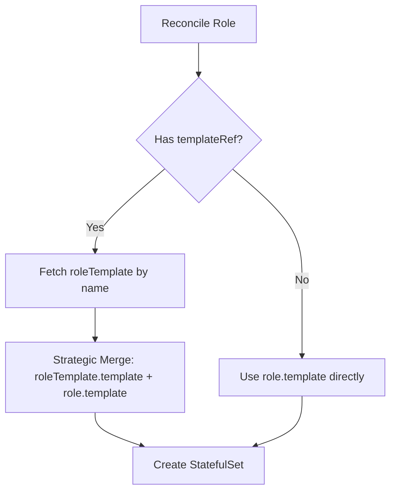
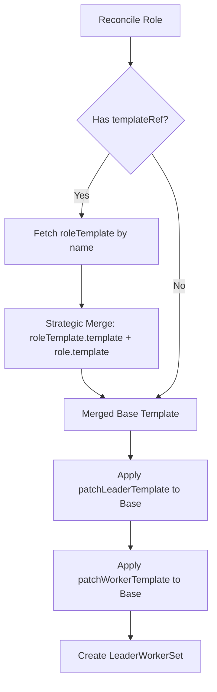

# KEP-8: Reduce YAML Duplication via RoleTemplates

This KEP focuses on Phase 1 (RoleTemplates) to reduce YAML duplication. Phase 2 (ExtraArgs) is deferred pending community feedback.

---

# Phase 1: Introduce RoleTemplates to Reduce YAML Duplication

## Summary

This KEP introduces `roleTemplates` field in RBG spec, enabling platform teams to define reusable Pod configurations that multiple roles can reference via `templateRef`. Uses Kubernetes Strategic Merge Patch for merging, reducing YAML duplication by approximately 20%.

## Motivation

Managing multi-role RBG deployments requires duplicating base configurations across every role:
- Each role repeats image, volumes, resources, environment variables
- Updating shared configuration requires modifying every role
- Manual updates lead to configuration drift and inconsistencies

### Goals
- Introduce `spec.roleTemplates` array for reusable Pod configurations
- Enable `role.templateRef` to reference templates within same RBG
- Use Kubernetes Strategic Merge Patch for configuration merging
- No template variables (no `{{.var}}` syntax)

### Non-Goals
- No separate CRD for templates
- No cross-RBG template references
- No template variable substitution

## Proposal

### User Stories

**Story 1**: Platform team defines base SGlang config once in roleTemplate, prefill/decode roles reference it via templateRef.

**Story 2**: SRE updates `roleTemplates[0].template.spec.containers[0].image`, controller automatically rolls update to all referencing roles.

### Risks and Mitigations

- **Strategic Merge complexity**: Users may not understand how volumes, env, and other fields merge, leading to configuration errors
  - **Mitigation 1**: Provide clear merge behavior table in documentation, explaining which fields merge by name vs complete replacement
  - **Mitigation 2**: Add dry-run capability to rbgctl (similar to `kubectl apply --dry-run`) to preview merged configuration before applying

- **Template reference errors**: Roles referencing non-existent templates cause deployment failures
  - **Mitigation**: Controller validates templateRef exists during reconciliation and returns explicit error messages

- **Unexpected field overrides**: Users unclear which roleTemplate fields are overridden by role.template
  - **Mitigation**: Document Strategic Merge behavior explicitly - resources/command use complete replacement, volumes/env merge by name

## Design Details

### API Overview

**Basic Example (StatefulSet)**:

```yaml
apiVersion: workloads.x-k8s.io/v1alpha1
kind: RoleBasedGroup
metadata:
  name: sglang-pd
spec:
  roleTemplates:
  - name: sglang-base
    template:
      spec:
        hostNetwork: true
        volumes:
        - name: model
          persistentVolumeClaim:
            claimName: llm-model
        - name: dshm
          emptyDir:
            medium: Memory
            sizeLimit: 15Gi
        containers:
        - name: sglang
          image: sglang:v0.5.1
          env:
          - name: POD_IP
            valueFrom:
              fieldRef:
                fieldPath: status.podIP
          volumeMounts:
          - mountPath: /models/Qwen3-32B/
            name: model
          - mountPath: /dev/shm
            name: dshm
          resources:
            requests:
              nvidia.com/gpu: "2"
            limits:
              nvidia.com/gpu: "2"
              rdma/hca: 1
              memory: "48Gi"

  roles:
  - name: prefill
    replicas: 2
    templateRef:
      name: sglang-base
    template:
      spec:
        containers:
        - name: sglang
          command:
          - python3
          - -m
          - sglang.launch_server
          - --model-path
          - /models/Qwen3-32B/
          - --enable-dp-attention
          - --enable-dp-lm-head
          - --enable-deepep-moe
          - --mem-fraction-static
          - "0.849"
          - --disaggregation-mode
          - prefill
          - --max-running-requests
          - "2048"
          - --port
          - "30000"

  - name: decode
    replicas: 1
    templateRef:
      name: sglang-base
    template:
      spec:
        containers:
        - name: sglang
          command:
          - python3
          - -m
          - sglang.launch_server
          - --model-path
          - /models/Qwen3-32B/
          - --enable-dp-attention
          - --enable-dp-lm-head
          - --enable-deepep-moe
          - --mem-fraction-static
          - "0.849"
          - --disaggregation-mode
          - decode
          - --max-running-requests
          - "4096"
          - --port
          - "30001"
```

This eliminates duplication of image, volumes, resources, env variables across roles. Command parameters remain role-specific.

**LWS Example (Multi-node Inference)**:

```yaml
apiVersion: workloads.x-k8s.io/v1alpha1
kind: RoleBasedGroup
metadata:
  name: sglang-multi-node
spec:
  roleTemplates:
  - name: sglang-base
    template:
      spec:
        volumes:
        - name: model
          persistentVolumeClaim:
            claimName: llm-model
        - name: dshm
          emptyDir:
            medium: Memory
            sizeLimit: 15Gi
        containers:
        - name: sglang
          image: sglang:v0.5.1
          volumeMounts:
          - mountPath: /models/Qwen3-32B
            name: model
          - mountPath: /dev/shm
            name: dshm
          resources:
            limits:
              nvidia.com/gpu: "1"
              memory: "48Gi"

  roles:
  - name: inference
    replicas: 1
    templateRef:
      name: sglang-base
    workload:
      apiVersion: leaderworkerset.x-k8s.io/v1
      kind: LeaderWorkerSet
    leaderWorkerSet:
      size: 2
      patchLeaderTemplate:
        spec:
          containers:
          - name: sglang
            command:
            - sh
            - -c
            - "python3 -m sglang.launch_server --model-path /models/Qwen3-32B --tp 2 --dist-init-addr $(LWS_LEADER_ADDRESS):20000 --nnodes $(LWS_GROUP_SIZE) --node-rank $(LWS_WORKER_INDEX) --host 0.0.0.0 --port 8000"
            ports:
            - containerPort: 8000
            readinessProbe:
              tcpSocket:
                port: 8000
      patchWorkerTemplate:
        spec:
          containers:
          - name: sglang
            command:
            - sh
            - -c
            - "python3 -m sglang.launch_server --model-path /models/Qwen3-32B --tp 2 --dist-init-addr $(LWS_LEADER_ADDRESS):20000 --nnodes $(LWS_GROUP_SIZE) --node-rank $(LWS_WORKER_INDEX)"
```

In LWS scenarios, roleTemplate provides shared configuration (image, volumes, resources), while patchLeaderTemplate/patchWorkerTemplate customize distributed commands using LWS environment variables.

**Merge Behavior**:

| Field | Merge Strategy | Example |
|-------|---------------|---------|
| Volumes | Merge by `name` | Template has volume "model", role adds "cache" → Both present |
| Env | Merge by `name` | Template has env "POD_IP", role adds "ROLE" → Both present |
| Resources | Replace entirely | Template has 2 GPU, role specifies 4 GPU → 4 GPU used |
| Command | Replace entirely | Template has base cmd, role specifies full cmd → Role cmd used |

### Controller Behavior

**StatefulSet Scenario**:


**LWS Scenario**:


**Processing Order**:
1. Validate templateRef exists in roleTemplates array
2. Fetch roleTemplate by name
3. Strategic Merge: `roleTemplate.template` + `role.template` → merged base template
4. For LWS workloads:
   - Apply `patchLeaderTemplate` to merged base → Leader Pod spec
   - Apply `patchWorkerTemplate` to merged base → Worker Pod spec
5. For StatefulSet workloads:
   - Use merged base template directly
6. Create workload (StatefulSet or LeaderWorkerSet)

**Important**: The `role.template` field serves as both:
- Source for Strategic Merge with roleTemplate
- Base template for LWS patchLeaderTemplate/patchWorkerTemplate

This means patchLeaderTemplate/patchWorkerTemplate apply **after** roleTemplate merging.

### Test Plan

**Unit Tests**:
- Template resolution by name
- Strategic Merge logic for different field types (volumes, env, resources, command)
- Validation: templateRef references non-existent template
- Validation: templateRef references template in different RBG (should fail)

**Integration Tests**:
- Create RBG with roleTemplates, verify merge behavior
- Update roleTemplate image, verify all referencing roles updated
- LWS scenario: verify patchLeaderTemplate/patchWorkerTemplate applied after merge

**E2E Tests**:
- Deploy multi-role RBG using roleTemplates
- Update roleTemplate configuration, verify rolling update across all roles
- **ControllerRevision rollback**: Update roleTemplate, verify rollback capability works correctly
- LWS deployment: verify leader and worker Pods have correct merged configuration

**Manual Verification**:
- Use `rbgctl get rbg <name> --dry-run` to preview merged configuration before applying
- Verify error messages when templateRef is invalid
## Alternatives

- **Helm**: Static templating, no runtime updates
- **Kustomize**: No centralized template management
- **Separate CRD**: Adds complexity, cross-resource references

## Future Considerations

### Command Parameter Deduplication

Current roleTemplate eliminates image/volumes/resources duplication, but command parameters remain duplicated. For example, the prefill and decode roles above share identical command parameters.

A potential future enhancement could introduce `extraArgs` field in RoleSpec for appending command parameters using simple array concatenation:

```yaml
roleTemplates:
- name: sglang-base
  template:
    spec:
      containers:
      - name: sglang
        command:
        - python3
        - -m
        - sglang.launch_server
        - --model-path
        - /models/Qwen3-32B/
        - --enable-dp-attention
        # ... common parameters

roles:
- name: prefill
  templateRef:
    name: sglang-base
  extraArgs:
  - --disaggregation-mode
  - prefill
  - --max-running-requests
  - "2048"
```

**Status**: Deferred pending community feedback on Phase 1 adoption and production usage patterns.

## Implementation History

- **2025-10-21**: Initial KEP-8 proposal submitted
- **2025-10-23**: Revised to focus on RoleTemplates (Phase 1), defer ExtraArgs
