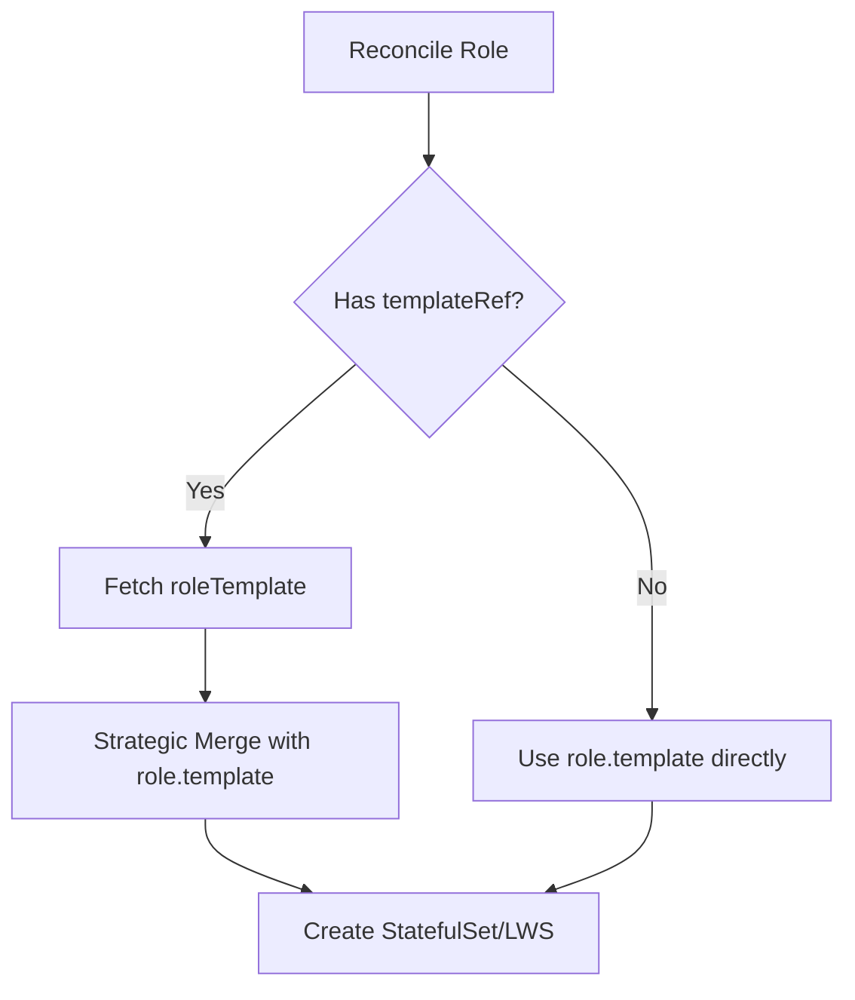
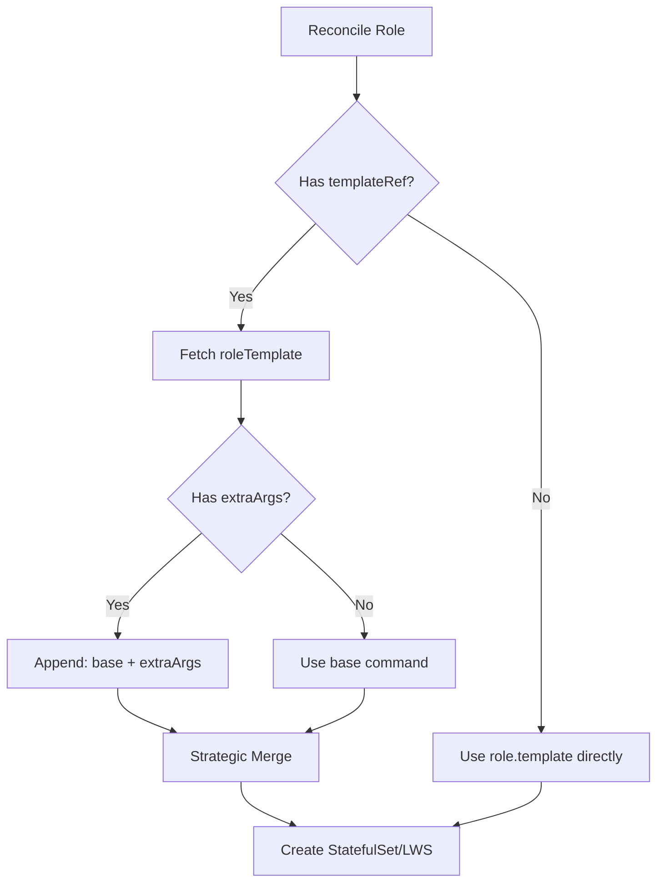

# KEP-8: Reduce YAML Duplication via RoleTemplates and ExtraArgs

This KEP proposes a two-phase approach to reduce YAML configuration duplication in RoleBasedGroup:
- Phase 1: RoleTemplates (~20% YAML reduction)
- Phase 2: ExtraArgs (~15-20% additional reduction)

---

# Phase 1: Introduce RoleTemplates to Reduce YAML Duplication

## Summary

This phase introduces `roleTemplates` field in RBG spec, enabling platform teams to define reusable Pod configurations that multiple roles can reference via `templateRef`. Uses Kubernetes Strategic Merge Patch for merging, reducing YAML by 20%.

## Motivation

Managing multi-role RBG deployments requires duplicating base configurations across every role:
- Each role repeats image, volumes, resources, environment variables
- Updating shared configuration requires modifying every role
- Manual updates lead to configuration drift

### Goals
- Introduce `spec.roleTemplates` array for reusable Pod configurations
- Enable `role.templateRef` to reference templates within same RBG
- Use Strategic Merge Patch for configuration merging
- No template variables (no `{{.var}}` syntax)

### Non-Goals
- No separate CRD for templates
- No cross-RBG template references
- No template variable substitution

## Proposal

### User Stories

**Story 1**: Platform team defines base SGlang config once in roleTemplate, prefill/decode roles reference it.

**Story 2**: SRE updates `roleTemplates[0].template.spec.containers[0].image`, controller rolls all roles automatically.

### Risks and Mitigations

- **Strategic Merge complexity**: Users may not understand how volumes, env, and other fields merge, leading to configuration errors
  - Mitigation: Provide clear merge behavior table in documentation, explaining which fields merge by name vs complete replacement

- **Template reference errors**: Roles referencing non-existent templates cause deployment failures
  - Mitigation: Controller validates templateRef exists during reconciliation and returns explicit error messages

- **Unexpected field overrides**: Users unclear which roleTemplate fields are overridden by role.template
  - Mitigation: Document Strategic Merge behavior explicitly - resources/command use complete replacement, volumes/env merge by name

## Design Details

### API Overview

```yaml
apiVersion: workloads.x-k8s.io/v1alpha1
kind: RoleBasedGroup
metadata:
  name: sglang-pd
spec:
  roleTemplates:
  - name: sglang-base
    template:
      spec:
        hostNetwork: true
        volumes:
        - name: model
          persistentVolumeClaim:
            claimName: llm-model
        - name: dshm
          emptyDir:
            medium: Memory
            sizeLimit: 15Gi
        containers:
        - name: sglang
          image: sglang:v0.5.1
          env:
          - name: POD_IP
            valueFrom:
              fieldRef:
                fieldPath: status.podIP
          volumeMounts:
          - mountPath: /models/Qwen3-32B/
            name: model
          - mountPath: /dev/shm
            name: dshm
          resources:
            requests:
              nvidia.com/gpu: "2"
            limits:
              nvidia.com/gpu: "2"
              rdma/hca: 1
              memory: "48Gi"

  roles:
  - name: prefill
    replicas: 2
    templateRef:
      name: sglang-base
    template:
      spec:
        containers:
        - name: sglang
          command:
          - python3
          - -m
          - sglang.launch_server
          - --model-path
          - /models/Qwen3-32B/
          - --enable-dp-attention
          - --enable-dp-lm-head
          - --enable-deepep-moe
          - --mem-fraction-static
          - "0.849"
          - --disaggregation-mode
          - prefill
          - --max-running-requests
          - "2048"
          - --port
          - "30000"

  - name: decode
    replicas: 1
    templateRef:
      name: sglang-base
    template:
      spec:
        containers:
        - name: sglang
          command:
          - python3
          - -m
          - sglang.launch_server
          - --model-path
          - /models/Qwen3-32B/
          - --enable-dp-attention
          - --enable-dp-lm-head
          - --enable-deepep-moe
          - --mem-fraction-static
          - "0.849"
          - --disaggregation-mode
          - decode
          - --max-running-requests
          - "4096"
          - --port
          - "30001"
```

Phase 1 eliminates duplication of image, volumes, resources, env. Command parameters still duplicated.

**LWS Example (Multi-node Inference)**:

```yaml
apiVersion: workloads.x-k8s.io/v1alpha1
kind: RoleBasedGroup
metadata:
  name: sglang-multi-node
spec:
  roleTemplates:
  - name: sglang-base
    template:
      spec:
        volumes:
        - name: model
          persistentVolumeClaim:
            claimName: llm-model
        - name: dshm
          emptyDir:
            medium: Memory
            sizeLimit: 15Gi
        containers:
        - name: sglang
          image: sglang:v0.5.1
          volumeMounts:
          - mountPath: /models/Qwen3-32B
            name: model
          - mountPath: /dev/shm
            name: dshm
          resources:
            limits:
              nvidia.com/gpu: "1"
              memory: "48Gi"

  roles:
  - name: inference
    replicas: 1
    templateRef:
      name: sglang-base
    workload:
      apiVersion: leaderworkerset.x-k8s.io/v1
      kind: LeaderWorkerSet
    leaderWorkerSet:
      size: 2
      patchLeaderTemplate:
        spec:
          containers:
          - name: sglang
            command:
            - sh
            - -c
            - "python3 -m sglang.launch_server --model-path /models/Qwen3-32B --tp 2 --dist-init-addr $(LWS_LEADER_ADDRESS):20000 --nnodes $(LWS_GROUP_SIZE) --node-rank $(LWS_WORKER_INDEX) --host 0.0.0.0 --port 8000"
            ports:
            - containerPort: 8000
            readinessProbe:
              tcpSocket:
                port: 8000
      patchWorkerTemplate:
        spec:
          containers:
          - name: sglang
            command:
            - sh
            - -c
            - "python3 -m sglang.launch_server --model-path /models/Qwen3-32B --tp 2 --dist-init-addr $(LWS_LEADER_ADDRESS):20000 --nnodes $(LWS_GROUP_SIZE) --node-rank $(LWS_WORKER_INDEX)"
```

In LWS multi-node scenarios, RoleTemplate defines shared configuration while patchLeaderTemplate/patchWorkerTemplate customize distributed commands with LWS environment variables.

**Merge Behavior**:

| Field | Merge Strategy |
|-------|---------------|
| Volumes | Merge by `name` |
| Env | Merge by `name` |
| Resources | Replace entirely |
| Command | Replace entirely |

### Controller Behavior



Processing order:
1. Fetch roleTemplate by name
2. Strategic Merge with role.template
3. Create workload

### Test Plan

- Unit: Template resolution, merge logic, validation
- Integration: Create RBG with roleTemplates, verify merge behavior
- E2E: Deploy multi-role RBG, verify rolling updates on template change

## Alternatives

- **Helm**: Static templating, no runtime updates
- **Kustomize**: No centralized template management
- **Separate CRD**: Adds complexity, cross-resource references

---

# Phase 2: Introduce ExtraArgs to Eliminate Command Parameter Duplication

## Summary

This phase builds on Phase 1 by introducing `extraArgs` field in RoleSpec to eliminate command parameter duplication. Platform teams define base commands in roleTemplates, application teams append role-specific parameters using simple array concatenation.

**Prerequisites**: Depends on Phase 1 being implemented first.

## Motivation

Phase 1 eliminated duplication of image, volumes, resources, but command parameters remain duplicated:
- 10/16 command parameters identical across roles
- Platform team cannot define shared command base
- Updates to common parameters require modifying every role

### Goals
- Introduce `role.extraArgs` field for appending command parameters
- Use simple array concatenation: `finalCommand = baseCommand + extraArgs`
- Maintain compatibility with Phase 1 roleTemplates
- No template variables (no `{{.var}}` syntax)

### Non-Goals
- No shell scripting or `sh -c` support
- ExtraArgs only for containers[0].command
- No different extraArgs for LWS leader vs worker

## Proposal

### User Stories

**Story 1**: Platform team defines base command in roleTemplate, application teams only specify business parameters via extraArgs.

**Story 2**: Platform team adds `--enable-chunked-prefill` to roleTemplate.command, propagates to all roles automatically.

### Risks and Mitigations

- **Custom append behavior**: extraArgs array concatenation is not a native Kubernetes mechanism, users may be confused
  - Mitigation: Document as RBG-specific convenience feature (similar to Kustomize), provide clear formula explanation

- **extraArgs conflicts with role.template.command**: Setting both creates ambiguity about final command
  - Mitigation: Controller validates they are mutually exclusive and returns explicit error message

- **Multi-container limitations**: extraArgs only applies to containers[0], cannot be used in multi-container scenarios
  - Mitigation: Document limitation clearly, recommend using role.template.command directly for multi-container cases

- **LWS leader/worker differentiation**: extraArgs applies to all replicas, cannot customize commands for leader specifically
  - Mitigation: Document limitation, provide workaround using patchLeaderTemplate for advanced scenarios

## Design Details

### API Overview

```yaml
apiVersion: workloads.x-k8s.io/v1alpha1
kind: RoleBasedGroup
metadata:
  name: sglang-pd
spec:
  roleTemplates:
  - name: sglang-base
    template:
      spec:
        hostNetwork: true
        volumes:
        - name: model
          persistentVolumeClaim:
            claimName: llm-model
        - name: dshm
          emptyDir:
            medium: Memory
            sizeLimit: 15Gi
        containers:
        - name: sglang
          image: sglang:v0.5.1
          command:
          - python3
          - -m
          - sglang.launch_server
          - --model-path
          - /models/Qwen3-32B/
          - --enable-dp-attention
          - --enable-dp-lm-head
          - --enable-deepep-moe
          - --mem-fraction-static
          - "0.849"
          env:
          - name: POD_IP
            valueFrom:
              fieldRef:
                fieldPath: status.podIP
          volumeMounts:
          - mountPath: /models/Qwen3-32B/
            name: model
          - mountPath: /dev/shm
            name: dshm
          resources:
            requests:
              nvidia.com/gpu: "2"
            limits:
              nvidia.com/gpu: "2"
              rdma/hca: 1
              memory: "48Gi"

  roles:
  - name: prefill
    replicas: 2
    templateRef:
      name: sglang-base
    extraArgs:
    - --disaggregation-mode
    - prefill
    - --max-running-requests
    - "2048"
    - --port
    - "30000"

  - name: decode
    replicas: 1
    templateRef:
      name: sglang-base
    extraArgs:
    - --disaggregation-mode
    - decode
    - --max-running-requests
    - "4096"
    - --port
    - "30001"
```

**Generated Prefill Pod Command**:
```yaml
command:
- python3
- -m
- sglang.launch_server
- --model-path
- /models/Qwen3-32B/
- --enable-dp-attention
- --enable-dp-lm-head
- --enable-deepep-moe
- --mem-fraction-static
- "0.849"
- --disaggregation-mode
- prefill
- --max-running-requests
- "2048"
- --port
- "30000"
```

**LWS Limitation with ExtraArgs**:

ExtraArgs has limitations in LWS scenarios where leader and worker require different command parameters:

```yaml
apiVersion: workloads.x-k8s.io/v1alpha1
kind: RoleBasedGroup
metadata:
  name: sglang-multi-node
spec:
  roleTemplates:
  - name: sglang-base
    template:
      spec:
        volumes:
        - name: model
          persistentVolumeClaim:
            claimName: llm-model
        containers:
        - name: sglang
          image: sglang:v0.5.1
          volumeMounts:
          - mountPath: /models/Qwen3-32B
            name: model
          resources:
            limits:
              nvidia.com/gpu: "1"

  roles:
  - name: inference
    replicas: 1
    templateRef:
      name: sglang-base
    workload:
      apiVersion: leaderworkerset.x-k8s.io/v1
      kind: LeaderWorkerSet
    leaderWorkerSet:
      size: 2
      patchLeaderTemplate:
        spec:
          containers:
          - name: sglang
            command:
            - sh
            - -c
            - "python3 -m sglang.launch_server --model-path /models/Qwen3-32B --tp 2 --dist-init-addr $(LWS_LEADER_ADDRESS):20000 --nnodes $(LWS_GROUP_SIZE) --node-rank $(LWS_WORKER_INDEX) --host 0.0.0.0 --port 8000"
            ports:
            - containerPort: 8000
      patchWorkerTemplate:
        spec:
          containers:
          - name: sglang
            command:
            - sh
            - -c
            - "python3 -m sglang.launch_server --model-path /models/Qwen3-32B --tp 2 --dist-init-addr $(LWS_LEADER_ADDRESS):20000 --nnodes $(LWS_GROUP_SIZE) --node-rank $(LWS_WORKER_INDEX)"
```

Limitation explanation:
- ExtraArgs applies uniformly to all replicas (both leader and worker)
- Cannot differentiate leader vs worker command parameters
- LWS multi-node scenarios require distributed parameters (dist-init-addr, nnodes, node-rank) that must be set via patchLeaderTemplate/patchWorkerTemplate
- Phase 2 primarily benefits StatefulSet scenarios, with limited gains for LWS

Formula: `finalCommand = roleTemplate.command + role.extraArgs`

**Merge Behavior**:

| RoleTemplate.command | Role.extraArgs | Role.template.command | Final Command |
|---------------------|----------------|----------------------|---------------|
| `[a, b]` | `[c, d]` | Not set | `[a, b, c, d]` |
| `[a, b]` | `[]` | Not set | `[a, b]` |
| `[a, b]` | `[c, d]` | `[x, y]` | **Validation Error** |

### Controller Behavior



Processing order:
1. Fetch roleTemplate
2. If extraArgs exists, append to base command
3. Strategic Merge with role.template
4. Create workload

**Validation Rules**:
- extraArgs requires templateRef
- extraArgs and role.template.command are mutually exclusive (returns validation error)

### Test Plan

- Unit: Command append logic, validation rules
- Integration: Create RBG with extraArgs, verify merged command
- E2E: Deploy multi-role RBG, verify command generation

## Alternatives

- **Helm/Kustomize**: Static, no runtime updates
- **Separate BaseCommand field**: Breaks PodTemplateSpec contract
- **Command Fragments**: Overly complex for simple append

---

## Implementation History

- **2025-01-21**: Initial KEP-8 proposal submitted
