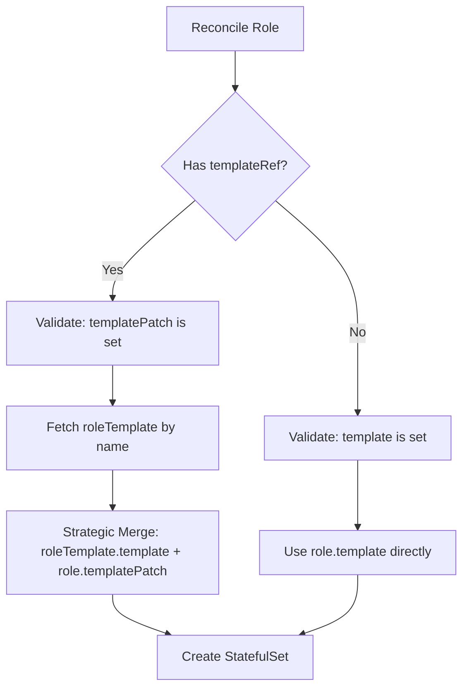
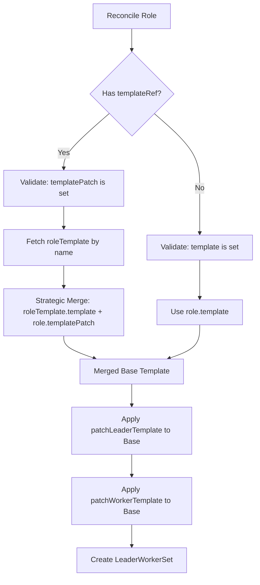
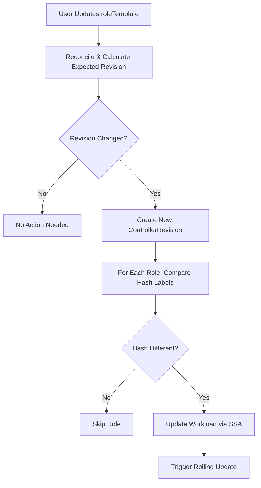

# KEP-8: Reduce YAML Duplication via RoleTemplates

## Summary

This KEP introduces `roleTemplates` field in RBG spec, enabling platform teams to define reusable Pod configurations that multiple roles can reference via `templateRef`. Roles use a `templatePatch` field to overlay role-specific configurations. Uses Kubernetes Strategic Merge Patch for merging, reducing YAML duplication by approximately 20%.

## Motivation

Managing multi-role RBG deployments requires duplicating base configurations across every role:
- Each role repeats image, volumes, resources, environment variables
- Updating shared configuration requires modifying every role
- Manual updates lead to configuration drift and inconsistencies

### Goals
- Introduce `spec.roleTemplates` array for reusable Pod configurations
- Enable `role.templateRef` to reference templates within same RBG
- Introduce `role.templatePatch` field for overlay configurations when using RoleTemplate
- Use Kubernetes Strategic Merge Patch for configuration merging
- No template variables (no `{{.var}}` syntax)

### Non-Goals
- No separate CRD for templates
- No cross-RBG template references
- No template variable substitution

## Proposal

### User Stories

**Story 1**: Platform team defines base SGlang config once in roleTemplate, prefill/decode roles reference it via templateRef.

**Story 2**: SRE updates `roleTemplates[0].template.spec.containers[0].image`, controller automatically rolls update to all referencing roles.

**Story 3**: User runs `kubectl rbg preview` to visualize merged configurations before applying.

### Risks and Mitigations

 - **Field naming ambiguity**: Using single field name for both complete config and overlay could cause confusion
    - **Mitigation**: Design separate fields (`template` for traditional mode, `templatePatch` for overlay mode) with mutual exclusivity, following Kubernetes ecosystem naming conventions (e.g., Argo Workflows `podSpecPatch`)

- **Strategic Merge complexity**: Users may not understand how volumes, env, and other fields merge, leading to configuration errors
  - **Mitigation 1**: Provide clear merge behavior table in documentation, explaining which fields merge by name vs complete replacement
  - **Mitigation 2**: Add preview/diff tools to visualize and compare merged configurations

- **Template reference errors**: Roles referencing non-existent templates cause deployment failures
  - **Mitigation**: Controller validates templateRef exists during reconciliation and returns explicit error messages

- **Unexpected field overrides**: Users unclear which roleTemplate fields are overridden by role.templatePatch
  - **Mitigation**: Document Strategic Merge behavior explicitly - resources/command use complete replacement, volumes/env merge by name

## Design Details

### Naming Convention

KEP-8 introduces the `templatePatch` field, following the `{target}Patch` naming pattern to align with Kubernetes ecosystem conventions:

- **Kubernetes ecosystem precedent**: Argo Workflows uses `podSpecPatch` (not `patchPodSpec`)
- **Semantic clarity**: `templatePatch` clearly indicates "a patch for the template" (noun + modifier)
- **API design principle**: Field names should describe content/type (noun), not operations (verb)

**Current naming landscape**:
```yaml
# KEP-8 (new, aligned with ecosystem)
role.templatePatch          # {target}Patch pattern

# Existing LWS fields (retained for backward compatibility)
leaderWorkerSet.patchLeaderTemplate  # patch{Target} pattern
leaderWorkerSet.patchWorkerTemplate  # patch{Target} pattern
```

**Future consideration**: A separate proposal may standardize existing LWS fields to `leaderTemplatePatch` / `workerTemplatePatch` for consistency, but this is deferred to avoid breaking changes in v1alpha1.

### Field Semantics: Template vs TemplatePatch

**Traditional Mode**:
```yaml
roles:
- name: prefill
  template:              # Complete configuration
    spec: {...}
```

**With RoleTemplate**:
```yaml
roleTemplates:
- name: base
  template:              # Base template
    spec: {...}

roles:
- name: prefill
  templateRef: {name: base}
  templatePatch:         # Overlay configuration
    spec: {...}
```

**Key Points**:
- `template` and `templatePatch` are mutually exclusive in `role`
- Naming follows `{target}Patch` convention (aligned with Argo Workflows `podSpecPatch`)
- Note: Existing LWS fields `patchLeaderTemplate`/`patchWorkerTemplate` retain current naming for backward compatibility

**Validation**:

| templateRef | template | templatePatch |
|-------------|----------|---------------|
| Not set | Required | Rejected |
| Set | Rejected | Required |

### API Overview

**Basic Example (StatefulSet)**:

```yaml
apiVersion: workloads.x-k8s.io/v1alpha1
kind: RoleBasedGroup
metadata:
  name: sglang-pd
spec:
  roleTemplates:
  - name: sglang-base
    template:
      spec:
        hostNetwork: true
        volumes:
        - name: model
          persistentVolumeClaim:
            claimName: llm-model
        - name: dshm
          emptyDir:
            medium: Memory
            sizeLimit: 15Gi
        containers:
        - name: sglang
          image: sglang:v0.5.1
          env:
          - name: POD_IP
            valueFrom:
              fieldRef:
                fieldPath: status.podIP
          volumeMounts:
          - mountPath: /models/Qwen3-32B/
            name: model
          - mountPath: /dev/shm
            name: dshm
          resources:
            requests:
              nvidia.com/gpu: "2"
            limits:
              nvidia.com/gpu: "2"
              rdma/hca: 1
              memory: "48Gi"

  roles:
  - name: prefill
    replicas: 2
    templateRef:
      name: sglang-base
    templatePatch:
      spec:
        containers:
        - name: sglang
          command:
          - python3
          - -m
          - sglang.launch_server
          - --model-path
          - /models/Qwen3-32B/
          - --enable-dp-attention
          - --enable-dp-lm-head
          - --enable-deepep-moe
          - --mem-fraction-static
          - "0.849"
          - --disaggregation-mode
          - prefill
          - --max-running-requests
          - "2048"
          - --port
          - "30000"

  - name: decode
    replicas: 1
    templateRef:
      name: sglang-base
    templatePatch:
      spec:
        containers:
        - name: sglang
          command:
          - python3
          - -m
          - sglang.launch_server
          - --model-path
          - /models/Qwen3-32B/
          - --enable-dp-attention
          - --enable-dp-lm-head
          - --enable-deepep-moe
          - --mem-fraction-static
          - "0.849"
          - --disaggregation-mode
          - decode
          - --max-running-requests
          - "4096"
          - --port
          - "30001"
```

This eliminates duplication of image, volumes, resources, env variables across roles. Command parameters remain role-specific.

**LWS Example (Multi-node Inference)**:

```yaml
apiVersion: workloads.x-k8s.io/v1alpha1
kind: RoleBasedGroup
metadata:
  name: sglang-multi-node
spec:
  roleTemplates:
  - name: sglang-base
    template:
      spec:
        volumes:
        - name: model
          persistentVolumeClaim:
            claimName: llm-model
        - name: dshm
          emptyDir:
            medium: Memory
            sizeLimit: 15Gi
        containers:
        - name: sglang
          image: sglang:v0.5.1
          volumeMounts:
          - mountPath: /models/Qwen3-32B
            name: model
          - mountPath: /dev/shm
            name: dshm
          resources:
            limits:
              nvidia.com/gpu: "1"
              memory: "48Gi"

  roles:
  - name: inference
    replicas: 1
    templateRef:
      name: sglang-base
    templatePatch:
      spec:
        containers:
        - name: sglang
          env:
          - name: MODEL
            value: Qwen3-32B
    workload:
      apiVersion: leaderworkerset.x-k8s.io/v1
      kind: LeaderWorkerSet
    leaderWorkerSet:
      size: 2
      patchLeaderTemplate:
        spec:
          containers:
          - name: sglang
            command:
            - sh
            - -c
            - "python3 -m sglang.launch_server --model-path /models/Qwen3-32B --tp 2 --dist-init-addr $(LWS_LEADER_ADDRESS):20000 --nnodes $(LWS_GROUP_SIZE) --node-rank $(LWS_WORKER_INDEX) --host 0.0.0.0 --port 8000"
            ports:
            - containerPort: 8000
            readinessProbe:
              tcpSocket:
                port: 8000
      patchWorkerTemplate:
        spec:
          containers:
          - name: sglang
            command:
            - sh
            - -c
            - "python3 -m sglang.launch_server --model-path /models/Qwen3-32B --tp 2 --dist-init-addr $(LWS_LEADER_ADDRESS):20000 --nnodes $(LWS_GROUP_SIZE) --node-rank $(LWS_WORKER_INDEX)"
```

In LWS scenarios, roleTemplate provides shared configuration (image, volumes, resources), `role.templatePatch` adds role-specific config, and patchLeaderTemplate/patchWorkerTemplate customize distributed commands.

**Merge Behavior**:

| Field | Merge Strategy | Example |
|-------|---------------|---------|
| Volumes | Merge by `name` | Template has volume "model", templatePatch adds "cache" → Both present |
| Env | Merge by `name` | Template has env "POD_IP", templatePatch adds "ROLE" → Both present |
| Resources | Replace entirely | Template has 2 GPU, templatePatch specifies 4 GPU → 4 GPU used |
| Command | Replace entirely | Template has base cmd, templatePatch specifies full cmd → templatePatch cmd used |

> Uses Kubernetes [Strategic Merge Patch](https://kubernetes.io/docs/tasks/manage-kubernetes-objects/update-api-object-kubectl-patch/#use-a-strategic-merge-patch-to-update-a-deployment) for native merge semantics.


### Controller Behavior

**StatefulSet Scenario**:


**LWS Scenario**:


**Processing Order**:
1. Validate: `template` XOR `templatePatch` based on `templateRef`
2. Fetch roleTemplate by name (if using RoleTemplate)
3. Strategic Merge: `roleTemplate.template` + `role.templatePatch` → merged base template
4. For LWS workloads:
   - Apply `patchLeaderTemplate` to merged base → Leader Pod spec
   - Apply `patchWorkerTemplate` to merged base → Worker Pod spec
5. For StatefulSet workloads:
   - Use merged base template directly
6. Create workload (StatefulSet or LeaderWorkerSet)

**Important**: The `role.templatePatch` provides overlay for roleTemplate, then the merged result serves as base for LWS patches. This means patchLeaderTemplate/patchWorkerTemplate apply **after** roleTemplate merging.

#### Update Workflow

When a roleTemplate is updated, the controller automatically propagates changes to all referencing roles:



**Change Detection Mechanism**:
- Controller computes ControllerRevision hash from entire RBG Spec (including roleTemplates)
- When roleTemplate changes → RBG Spec changes → New Revision created with incremented number
- All role hashes are recalculated from the new Revision

**Update Trigger**:
- Each workload carries a `role-revision-hash-{roleName}` label
- Reconciler compares current label value with expected hash from new Revision
- If different → Resolves template (merging updated `roleTemplate.template` + `role.templatePatch`) → Updates workload via Server-Side Apply
- Workload controller (StatefulSet/Deployment/LWS) detects PodTemplate change → Triggers rolling update per rolloutStrategy

#### ControllerRevision Evolution During roleTemplate Update

**Example Scenario**: User updates `spec.roleTemplates[0].template.spec.containers[0].image: v1.0 → v2.0`

| Phase | ControllerRevision State | Role Hashes | Workload State | Action |
|-------|-------------------------|-------------|----------------|---------|
| **Before Update** | `my-rbg-abc123-1`<br/>• Revision: 1<br/>• Data contains image: v1.0 | prefill: hash1<br/>decode: hash2 | StatefulSets running with:<br/>• Labels: hash1, hash2<br/>• Pods: image v1.0 | - |
| **After roleTemplate Update** | **New**: `my-rbg-xyz789-2`<br/>• Revision: 2<br/>• Data contains image: v2.0<br/>**Old**: abc123-1 (kept for history) | Recalculated:<br/>prefill: hash3<br/>decode: hash4 | Labels updated: hash1→hash3, hash2→hash4<br/>PodTemplate updated: v1.0→v2.0 | Server-Side Apply updates workloads |
| **Rolling Update** | Active: xyz789-2<br/>History: abc123-1 | prefill: hash3<br/>decode: hash4 | Pods replacing: v1.0 → v2.0<br/>Per rolloutStrategy settings | StatefulSet Controller manages rollout |

**Key Points**:
1. **Revision Number Increments**: Each RBG Spec change creates a new Revision (1 → 2)
2. **Hash Recalculation**: Role hashes are derived from the Revision, so roleTemplate changes automatically propagate
3. **Label-based Detection**: Workload updates triggered by comparing current vs expected role hash labels
4. **History Retention**: Old Revisions kept (up to 5) for rollback capability
5. **Automatic Propagation**: All roles referencing the updated roleTemplate receive updates simultaneously

**Rollback Behavior**:
```yaml
# User applies previous RBG configuration
kubectl apply -f rbg-with-image-v1.0.yaml

# Controller creates NEW Revision with old content:
# - my-rbg-abc123-5 (same hash abc123, new number 5)
# - Role hashes return to hash1, hash2
# - Workloads roll back: v2.0 → v1.0
```

Rollback creates a new Revision (incrementing number) with previous content, maintaining linear history while allowing bidirectional updates.

### Preview and Diff Tools

To help users understand Strategic Merge behavior, KEP-8 provides preview/diff capabilities via kubectl plugins:

#### Preview: Visualize Merged Configurations

```bash
kubectl rbg preview my-rbg.yaml
```

Resolves and displays the final PodTemplateSpec for each role after merging `roleTemplate.template` + `role.templatePatch`.

**Output Example**:
```yaml
# Role: prefill (resolved)
---
spec:
  containers:
  - name: sglang
    image: sglang:v0.5.1      # from roleTemplate
    command: [...]             # from templatePatch
    resources:
      limits:
        nvidia.com/gpu: "2"    # from roleTemplate

# Role: decode (resolved)
---
spec:
  containers:
  - name: sglang
    image: sglang:v0.5.1      # from roleTemplate
    command: [...]             # from templatePatch (different from prefill)
```

#### Diff: Compare Configurations

```bash
kubectl rbg diff my-rbg.yaml
```

Compares resolved configurations between local YAML file and cluster state.

**Output Example**:
```diff
Role: prefill
- image: sglang:v0.5.0        # cluster
+ image: sglang:v0.5.1        # local

Role: decode
- image: sglang:v0.5.0
+ image: sglang:v0.5.1
```

**Use Cases**:
- Validate merge behavior before applying changes
- Understand impact of roleTemplate modifications on all referencing roles
- Review configuration changes during PR reviews

**Implementation**: Extends existing `kubectl-rbg-*` plugin pattern with new commands.

### Test Plan

**Unit Tests**:
- Template resolution by name
- Strategic Merge logic for different field types (volumes, env, resources, command)
- Validation: `templatePatch` requires `templateRef`
- Validation: `template` and `templatePatch` are mutually exclusive
- Validation: templateRef references non-existent template
- Validation: templateRef references template in different RBG (should fail)

**Integration Tests**:
- Create RBG with roleTemplates, verify merge behavior
- Update roleTemplate image, verify all referencing roles updated
- LWS scenario: verify patchLeaderTemplate/patchWorkerTemplate applied after merge
- Preview: verify resolved output correctness
- Diff: verify comparison logic

**E2E Tests**:
- Deploy multi-role RBG using roleTemplates
- Update roleTemplate configuration, verify rolling update across all roles
- **ControllerRevision rollback**: Update roleTemplate, verify rollback capability works correctly
- LWS deployment: verify leader and worker Pods have correct merged configuration

**Manual Verification**:
- Use `kubectl rbg preview` to visualize merged configuration before applying
- Use `kubectl rbg diff` to compare local changes with cluster state
- Verify error messages when templateRef is invalid or fields are mutually exclusive

## Alternatives

**Helm**: Provides static templating but no runtime updates. Changing shared configuration requires re-rendering and re-applying charts.

**Kustomize**: Supports base/overlay pattern but lacks centralized template management within a single resource. Requires separate files.

**Separate Template CRD**: Would allow cross-RBG template sharing but adds complexity:
- Cross-resource references increase cognitive load
- RBAC complexity (who can modify templates?)
- Template versioning and compatibility issues

**Single `template` field with dual semantics**: Simpler API but confusing semantics (same field, different meaning based on `templateRef`). Community feedback favored explicit `templatePatch` field.

**RoleTemplate approach chosen because**:
- Templates scoped to single RBG (simpler RBAC)
- Native Strategic Merge Patch (Kubernetes-native behavior)
- Runtime updates without external tooling

## Future Considerations

### Command Parameter Deduplication

Current roleTemplate eliminates image/volumes/resources duplication, but command parameters remain duplicated. For example, the prefill and decode roles above share 10/16 identical command parameters.

A potential future enhancement could introduce `extraArgs` field in RoleSpec for appending command parameters using simple array concatenation:

```yaml
roleTemplates:
- name: sglang-base
  template:
    spec:
      containers:
      - name: sglang
        command:
        - python3
        - -m
        - sglang.launch_server
        - --model-path
        - /models/Qwen3-32B/
        - --enable-dp-attention
        # ... common parameters

roles:
- name: prefill
  templateRef:
    name: sglang-base
  templatePatch:
    spec:
      containers:
      - name: sglang
        # extraArgs appended to base command
  extraArgs:
  - --disaggregation-mode
  - prefill
  - --max-running-requests
  - "2048"
```

**Status**: Deferred pending community feedback on Phase 1 adoption and production usage patterns.

## Implementation History

- **2025-10-21**: Initial KEP-8 proposal submitted
- **2025-10-24**: Revised to focus on RoleTemplates (Phase 1), defer ExtraArgs
- **2025-10-27**: Supplemented Controller Behavior section with update workflow and ControllerRevision evolution details
- **2025-10-30**: Updated API design with `role.templatePatch` field and preview/diff tooling, aligned naming with Kubernetes ecosystem conventions