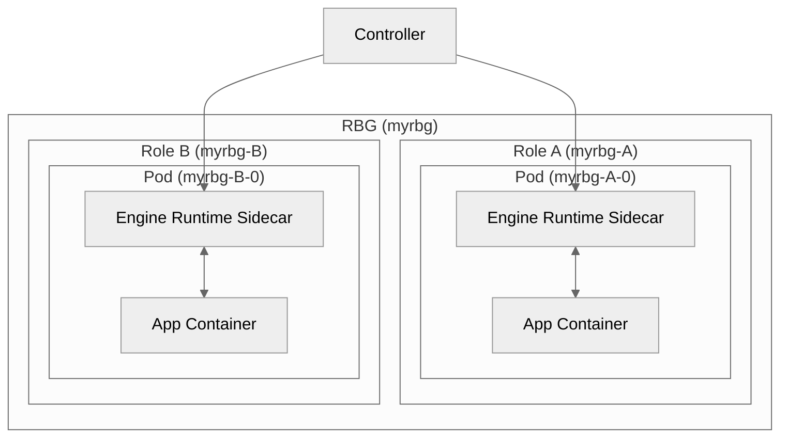

# KEP-92 Engine Runtime API

<!--
This is the title of your KEP. Keep it short, simple, and descriptive. A good
title can help communicate what the KEP is and should be considered as part of
any review.
-->

<!--
A table of contents is helpful for quickly jumping to sections of a KEP and for
highlighting any additional information provided beyond the standard KEP
template.

Ensure the TOC is wrapped with
  <code>&lt;!-- toc --&rt;&lt;!-- /toc --&rt;</code>
tags, and then generate with `hack/update-toc.sh`.
-->

<!-- toc -->
- [Motivation](#motivation)
- [Proposal](#proposal)
    - [User Stories (Optional)](#user-stories-optional)
        - [Story 1](#story-1)
    - [Risks and Mitigations](#risks-and-mitigations)
- [Design Details](#design-details)
    - [Implementation](#implementation)
    - [Test Plan](#test-plan)
        - [Unit Tests](#unit-tests)
        - [Integration tests](#integration-tests)
        - [End to End Tests](#end-to-end-tests)
<!-- /toc -->

## Motivation

<!--
This section is for explicitly listing the motivation, goals, and non-goals of
this KEP.  Describe why the change is important and the benefits to users. The
motivation section can optionally provide links to [experience reports] to
demonstrate the interest in a KEP within the wider Kubernetes community.

[experience reports]: https://github.com/golang/go/wiki/ExperienceReports
-->

1. Running inference engines in a Kubernetes cluster usually requires network topology information of inference engine Pods. Prefill-Decode disaggregation deployment typically consists of three roles: router, prefill worker, and decode worker. The Router maintains the network topology information of the active prefill worker pods and decode worker pods (e.g., Pod IPs or Pod domain names). If any of them scales in or out, the router should update topology to accurately adapt request scheduling behavior.

2. To maximize GPU resource utilization efficiency, inference engines support modifying their internal state without downtime. Such capabilities include dynamic updates for LoRA（[SGLang](https://docs.sglang.ai/advanced_features/lora.html#Dynamic-LoRA-loading)、[vLLM](https://docs.vllm.ai/en/stable/features/lora.html#dynamically-serving-lora-adapters)）, as well as memory release and restore （[SGLang](https://github.com/fzyzcjy/torch_memory_saver)) . When the inference engine runs in containerized mode, these state changes are invisible to the Kubernetes cluster. It's hard to orchestrate such changes with Kubernetes resources.


## Proposal

<!--
This is where we get down to the specifics of what the proposal actually is.
This should have enough detail that reviewers can understand exactly what
you're proposing, but should not include things like API designs or
implementation. What is the desired outcome and how do we measure success?.
The "Design Details" section below is for the real
nitty-gritty.
-->

### User Stories (Optional)

<!--
Detail the things that people will be able to do if this KEP is implemented.
Include as much detail as possible so that people can understand the "how" of
the system. The goal here is to make this feel real for users without getting
bogged down.
-->

1. As an AI engineer who deploys inference services, I expect the deployed Prefill-Decode disaggregation inference service to support  autoscaling. The scaling process should not affect the availability of the inference service. Furthermore, once scaling operations are completed, the routing layer (e.g., sgl-router) should update the inference service's topology as quickly as possible to ensure that the scaling works.

2. As an AI engineer who deploys inference services, I'd like to load/unload LoRA dynamically without restarting a inference engine. Also, operator, gateway and other Kubernetes components should change their behaviors to respond to the LoRA changes.

3. As an AI engineer who deploys inference services, I hope to debug, profile or audit a inference engine's execution. 

## Design Details

<!--
This section should contain enough information that the specifics of your
change are understandable. This may include API specs (though not always
required) or even code snippets. If there's any ambiguity about HOW your
proposal will be implemented, this is the place to discuss them.
-->
### Engine Runtime API

A new CRD called ClusterEngineRuntimeProfilewill be introduced. It describes a cluster-scoped engine runtime sidecar contaienr spec that can be reused anywhere in RBG's role specs. A short example: 

```yaml
apiVersion: workloads.x-k8s.io/v1alpha1
kind: ClusterEngineRuntimeProfile
metadata:
  name: sglang-pd-runtime
spec:
  containers:
    - image: 
      imagePullPolicy: Always
      name: engine-runtime
      env:
        - name: TOPO_TYPE
          value: "sglang"
        - name: SGL_ROUTER_ROLE_NAME
          value: "router"
  updateStrategy: NoUpdate
```

If a RBG needs the engine runtime sidecar container, specify the ClusterEngineRuntimeProfile's name in RBG's role spec. Engine runtime sidecar container's spec will be merged into the container spec defined in ClusterEngineRuntimeProfile.

```yaml
roles:
- name: prefill
  ...
  engineRuntimes:
    - profileName: sglang-pd-runtime
      containers:
      - name: patio-runtime
        args:
        - --instance-info={"data":{"port":8000,"worker_type":"prefill", "bootstrap_port":34000}}
        env:
        - name: SGL_ROUTER_PORT
          value: "8000"
```

### Architecture



## Implementation Details for Engine Runtime Sidecar

### Inference Engine (Base Class)

```python
@dataclass
class InferenceEngine(ABC):
    name: str
    version: str
    endpoint: str
    headers: Optional[dict] = None

    async def ready(self) -> bool:
        return _is_url_ready(self.endpoint) if self.endpoint else True

    async def load_lora_adapter(
            self, request: LoadLoraAdapterRequest
    ) -> Union[ErrorResponse, str]:
        return not_implemented_error(
            f"Inference engine {self.name} with version {self.version} not support load lora adapter")

    async def unload_lora_adapter(
            self, request: UnLoadLoraAdapterRequest
    ) -> Union[ErrorResponse, str]:
        return not_implemented_error(
            f"Inference engine {self.name} with version {self.version} not support unload lora adapter")
```

The InferenceEngineclass currently supporting LoRA-related load/unload operations. For different inference engines (vLLM or SGLang), InferenceEngine will send proper LoRA loading or unloading requests to the HTTP endpoints of inference engine.
In the future, additional operations can be extended within InferenceEngine.


### Topology Manager

```python
class TopoManager(ABC):
    def __init__(self, engine: InferenceEngine, worker_info: dict):
        self.engine = engine
        wait_until_engine_ready(self.engine, timeout=180)
        self.register(worker_info)
        self.worker_info = worker_info
        signal.signal(signal.SIGTERM, gracefully_stop_handler)
        signal.signal(signal.SIGINT, gracefully_stop_handler)

    @abstractmethod
    def register(self, worker_info: dict):
        raise NotImplementedError

    @abstractmethod
    def unregister(self):
        raise NotImplementedError

    @abstractmethod
    def refresh_worker_info(new_worker_info: dict):
        raise NotImplementedError
```
- `register`: register a worker to scheduler/router role.
- `unregister`: unregister a worker from scheduler/router role.
- `refresh_worker_info`: refresh worker info. Useful for updating request scheduling priority or weight.

### Test Plan

<!--
**Note:** *Not required until targeted at a release.*
The goal is to ensure that we don't accept enhancements with inadequate testing.

All code is expected to have adequate tests (eventually with coverage
expectations). Please adhere to the [Kubernetes testing guidelines][testing-guidelines]
when drafting this test plan.

[testing-guidelines]: https://git.k8s.io/community/contributors/devel/sig-testing/testing.md
-->

#### Unit Tests

<!--
In principle every added code should have complete unit test coverage, so providing
the exact set of tests will not bring additional value.
However, if complete unit test coverage is not possible, explain the reason of it
together with explanation why this is acceptable.
-->

<!--
Additionally, try to enumerate the core package you will be touching
to implement this enhancement and provide the current unit coverage for those
in the form of:
- <package>: <date> - <current test coverage>

This can inform certain test coverage improvements that we want to do before
extending the production code to implement this enhancement.
-->

#### Integration tests

<!--
Describe what tests will be added to ensure proper quality of the enhancement.

After the implementation PR is merged, add the names of the tests here.
-->

#### End to End Tests


## Alternatives

<!--
What other approaches did you consider, and why did you rule them out? These do
not need to be as detailed as the proposal, but should include enough
information to express the idea and why it was not acceptable.
-->