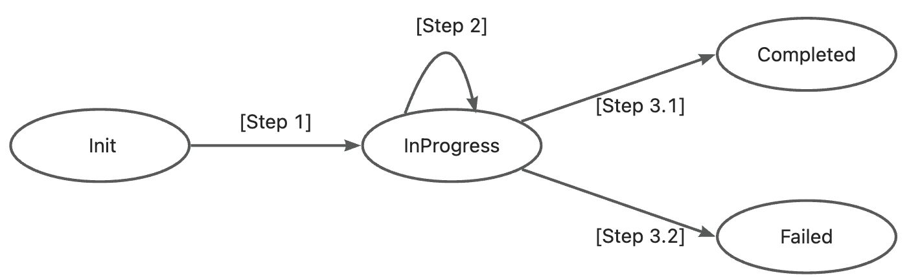

# KEP-XX: Image and Volume Warmup for RoleBasedGroup

## Table of Contents

<!-- toc -->

- [Release Signoff Checklist](#release-signoff-checklist)
- [Summary](#summary)
- [Motivation](#motivation)
    - [Goals](#goals)
    - [Non-Goals](#non-goals)
- [Proposal](#proposal)
    - [User Stories](#user-stories)
        - [Story 1](#story-1)
        - [Story 2](#story-2)
    - [Implementation Details](#implementation-details)
        - [API Changes](#api-changes)
        - [Example](#yaml-example)
    - [Risks and Mitigations](#risks-and-mitigations)
- [Design Details](#design-details)
    - [Test Plan](#test-plan)
    - [Graduation Criteria](#graduation-criteria)
- [Implementation History](#implementation-history)
- [Drawbacks](#drawbacks)

<!-- /toc -->

## Release Signoff Checklist

- [ ] (R) Enhancement issue in release milestone, which links to KEP dir in [kubernetes/enhancements] (not the initial
  KEP PR)
- [ ] (R) KEP approvers have approved the KEP status as `implementable`
- [ ] (R) Design details are appropriately documented
- [ ] (R) Test plan is in place, giving consideration to SIG Architecture and SIG Testing input (including test
  refactors)
    - [ ] e2e Tests for all Beta API Operations (endpoints)
    - [ ] (R) Ensure GA e2e tests meet requirements
      for [Conformance Tests](https://github.com/kubernetes/community/blob/master/contributors/devel/sig-architecture/conformance-tests.md)
    - [ ] (R) Minimum Two Week Window for GA e2e tests to prove flake free
- [ ] (R) Graduation criteria is in place
    - [ ] (R) [all GA Endpoints](https://github.com/kubernetes/community/pull/1806) must be hit
      by [Conformance Tests](https://github.com/kubernetes/community/blob/master/contributors/devel/sig-architecture/conformance-tests.md)
      within one minor version of promotion to GA
- [ ] (R) Production readiness review completed
- [ ] (R) Production readiness review approved
- [ ] "Implementation History" section is up-to-date for milestone
- [ ] User-facing documentation has been created in [kubernetes/website], for publication to [kubernetes.io]
- [ ] Supporting documentation—e.g., additional design documents, links to mailing list discussions/SIG meetings,
  relevant PRs/issues, release notes

## Summary

This KEP proposes adding image and volume warmup capabilities to RoleBasedGroup (RBG). Cold start is a common problem for serving large language models(LLMs).
Cold start latency can be reduced by pre-warming the model files and the container image before a serving instance starts. In RBG's design, upgradation can be done in a fine-grained manner (e.g. [Role Coordination](../30-role-coordination/README.md)). Image and volume warmup can be an additional step to speed up the upgrade process, avoiding resource utilization downgradation.

## Motivation

In a production environment, availability and GPU resource utilization are key metrics for large language model inference services. In-place update reduces time consumption by avoiding recreating Pods, but the cold start latency of the inference service (e.g. SGLang Worker) can still be high and thus affecting service availability. There are two key factors that affect the cold start latency:
- The size of container's image size (e.g. SGLang v0.5.5 image size is about 27.5GB after decompression)
- The size of large language model files (e.g. Total size of Qwen3-32B is about 61GB)

Image and volume warmup can help reduce the cold start latency. By introducing an extra "warmup stage" before the upgrade process, the upgradation process can be more efficient. It takes less time for RoleBasedGroup to rolling update each inference engine instance, so both the service availability and GPU utilization will be improved. 

Without WarmUp:


With WarmUp


### Goals

- Support WarmUp job that can be submitted by a user. For each node in the cluster, the job warms up images and volumes according to the job's configuration.

### Non-Goals

- Althgouh it's possible to upgrade RBG and warm up images & volumes in a coordinated way, co-design between WarmUp and RBG's upgradation process is not a goal in this enhancement. 

## Proposal

### Architecture


The WarmUp Controller collects node information of all Pods under the target RBG. It deploys one WarmUp Pod to each node. Each WarmUp Pod contains:
- N containers for image warmup, configured with image=<new_image> and a startup command set to "sleep infinity"
- 1 container for volume warmup, which shares volumes with the inference service Pods of the RBG. The model files in the volume will be read sequentially after the container starts.

When the Pod becomes ready, the node is considered warmed up successfully. If all nodes have completed the process, the WarmUp succeeds.

### API Changes

```yaml
apiVersion: workloads.x-k8s.io/v1alpha1
kind: RoleBasedGroupWarmup
metadata:
  name: warmup-demo
  namespace: default
spec:
  policies:
    parallelism: 10 # how many nodes will be warmed up at the same time
    backoffLimit: 3 #
    timeoutSeconds: 300
    ttlSecondsAfterFinished: 86400
  images:
  - name: engine
    image: sglang:v0.5.0
  - name: router
    image: router:v0.3.0
  volumes:
    - name: model
      persistenVolumeClaim:
        claimName: llm-model
  targets:
    rbg:
      namespace: default
      name: sglang
      roles:
      - name: prefill
        imagesToWarmup: 
        - name: engine
        volumesToWarmup: 
        - name: model-1
          targetPath: /qwen-32b/
      - name: decode
        imagesToWarmup: 
        - name: engine
        volumesToWarmup: 
        - name: model-1
      - name: router
        imagesToWarmup: 
        - name: router
    nodes:
      nodeNames:
      - "mynode-1"
      - "mynode-2"
      labelSelector:
        "foo-label": "bar"
      imagesToWarmup:
      - name: engine
      - name: router
      volumesToWarmup:
      - name: model-1
```

## Design Details

The implementation will add a new reconciler called "WarmUpReconciler" in RBG's controller manager. `WarmUpReconciler` will watch for WarmUp CRs and trigger warmup tasks on each node and sync their status to the WarmUp CR.

### Controller Logic

#### WarmUp Job State Machine



- **Step 1:** The WarmUp controller validates the WarmUp CR and sets `WarmUp.status.phase` to `InProgress`.

- **Step 2:** The WarmUp controller selects matched nodes and triggers a task for each node to warm up the images and volumes. Total number of running tasks is limited by `WarmUp.spec.policy.parallelism`. The WarmUp controller polls the tasks' status and updates `WarmUp.status.succeededNodeNum` and `WarmUp.status.failedNodeNum` accordingly.

- **Step 3:**  If the sum of `WarmUp.status.succeededNodeNum` and `WarmUp.status.failedNodeNum` is equal to `WarmUp.status.desiredNodeNum`. The WarmUp job finishes.
  - **Step 3.1:** If `WarmUp.status.failedNodeNum == 0`, controller sets `WarmUp.status.phase` to `Completed`. 
  - **Step 3.2:** If `WarmUp.status.failedNodeNum > 0`, controller sets `WarmUp.status.phase` to `Failed`. Also, controller records failed node names in `WarmUp.status.

#### Important Notes

1. **Complexity Risk**: Adding coordination logic increases controller complexity
    - Mitigation: Implement thorough unit and integration tests

2. **Deadlock Risk**: Poorly configured coordination strategies could cause updates to stall
    - Mitigation: Add timeouts and clear status reporting

3. **Backward Compatibility**: Existing RoleBasedGroups should continue to work unchanged
    - Mitigation: Only apply coordination logic when `coordination` is specified

4. **Configuration conflict**: Coordination settings may conflict with each role’s own updateStrategy and Dependency configuration.
    - Mitigation: The coordination-driven upgrade process is not subject to Dependency constraints. Moreover, if a role is defined in coordination, validation will prohibit that role from specifying its own updateStrategy.


### Test Plan

#### Unit Tests

#### Integration Tests

#### E2E Tests

## Alternative Designs

### Architecture Alternatives

#### Alternative 1: Node Agent


Instead of creating WarmUp pod for each node, a node agent pod will be responsible for all warmup tasks issued by the warmup controller. Once the node agent receives the request, it warms up image by pulling it via a unix socket exposed by the container runtime (e.g. /var/run/containerd/containerd.sock). It warms up the volume by reading files stored in a volume that should be shared between the node agent and **ALL** the other inference service pods.


#### Alternative 2: Engine Runtime Sidecar


Instead of creating WarmUp pod for each node, warmup controller issues RPC requests to an engine runtime sidecar in RBG's pod. Once the engine runtime sidecar receives the request, it pulls image via a unix socket exposed by the container runtime (e.g. /var/run/containerd/containerd.sock). Also, it warms up the volume by reading files stored in the volume which is shared between the sidecar container and the main container.

#### Pros & Cons

| Architecture | Image WarmUp | Volume WarmUp (volume unchanged) | Volume WarmUp (volume changed) | Supported Scenarios | Extra Pod | Others |
| ------------ | ------------- | ------------------------------- | ------------------------------ | ------------------- | -------- | ------- |
| WarmUp Pod | ✅ | ✅ | ✅ | 1. In-place Upgrade <br> 2. Scaling out | One extra pod on each node for one WarmUp Job |  | 
| Engine Runtime Sidecar| ✅| ✅ | ❌ | 1. In-place Upgrade | No extra pod | |
| Node Agent | ✅ | ✅ | ❌ | 1. In-place Upgrade <br> 2. Scaling out | One extra node agent pod on each node |  |
